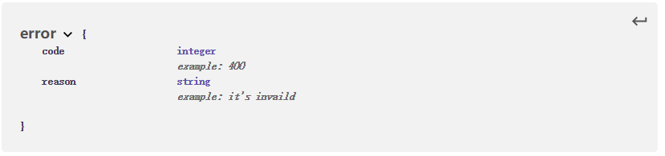

# 软件设计文档

|版本|日期|描述|作者|
-|-|-|-
v0.0|2019.5.14|初稿|章恒
v1.0|2019.5.27|完成API设计|章恒
v1.1|2019.5.28|完成数据库设计|章恒
v1.2|2019.6.23|完成模块设计、更新API设计|章恒
v1.3|2019.6.26|完成UI设计、架构设计|章恒

---
### 1. UI design
根据需求规格说明书（SRS）的补充需求，我们小组的UI设计由两个部分组成：**PC端**与**移动端**

#### PC端挣闲钱UI设计

#### 移动端挣闲钱UI设计

---
### 2. Database design

#### ER图

---
### 3. Interface API design 

**User**
- 数据结构

    
- API设计

    
    
    
    
    

**Tasks**
- 数据结构

    
    
- API设计

    
    
    
    
    
    

**Questionnaire**
- 数据结构

    
- API设计

    
    
    

**Error**
- 数据结构

    

---
### 4. 技术选型理由

---
### 5. Architecture design（架构设计）
    
---
### 6. Module dividing（模块划分）

---
### 7. 软件设计技术