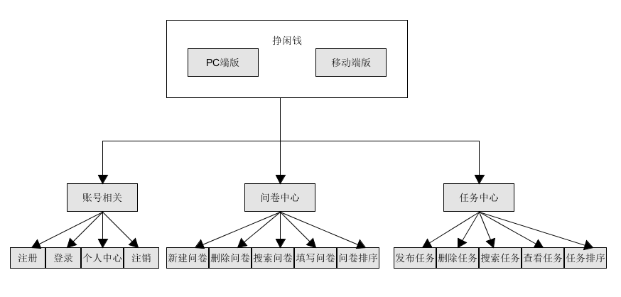

# 软件设计文档

|版本|日期|描述|作者|
-|-|-|-
v0.0|2019.5.14|初稿|章恒
v1.0|2019.5.27|完成API设计|章恒
v1.1|2019.5.28|完成数据库设计|章恒
v1.2|2019.6.23|完成模块设计、更新API设计|章恒
v1.3|2019.6.27|完成Server端的技术选型及理由、架构设计|朱俊凯

---
### 1. UI design
根据需求规格说明书（SRS）的补充需求，我们小组的UI设计由两个部分组成：**PC端**与**移动端**

#### PC端挣闲钱UI设计

#### 移动端挣闲钱UI设计

---
### 2. Database design

#### ER图

---
### 3. Interface API design 

**User**
- 数据结构

    
- API设计

    
    
    
    
    

**Tasks**
- 数据结构

    
    
- API设计

    
    
    
    
    
    

**Questionnaires**
- 数据结构

    
- API设计

    
    
    
    
    
    
    

**Error**
- 数据结构

    

---
### 4. 技术选型及理由

#### Server端

开发环境：Nodejs

> 理由：node.js 是一个服务器端运行JavaScript脚本的环境
* 这个环境下保持了前端JavaScript的api一致
* 动态语言，开发效率非常高，并有能力构建复杂系统
* Nodejs非常好的解决了IO密集的问题，通过异步IO来实现。
* 单线程单进程模式促使程序执行上下文不需要向其他服务器端语言一样切换运行时上下文,运行状态加锁,解锁等操作
* 相关教程也比较成熟

开发框架：Express

> 理由：Express是基于node.js平台的web应用开发框架，可以实现快速搭建骨架
* 历史更久，文档更完整，资料更多
* 自带 Router、路由规则等
* express提供了一个快速生成工具 express-generator，可以帮助我们快速创建一个项目的工具

中间件：

> 理由： 中间件（middleware）就是处理HTTP请求的函数。它最大的特点就是，一个中间件处理完，再传递给下一个中间件。App实例在运行过程中，会调用一系列的中间件。
* 缩短应用的开发周期，本来由程序开发做的控制，通过中间件介入都给你做了。
* 降低开发的失败率，通过引入成熟的中间件，增加了软件应用开发的成功率
* 提高应用的开发质量
* 减少前期开发成本和维护费用

数据库：Sequelize

> Sequelize 是 Node 的一个 ORM(Object-Relational Mapping) 框架，用来方便数据库操作。
nodejs最强的就是他的异步编程和网络设计，Sequelize框架本身就是支持Promise的，默认的也是异步调用（当然也可以写成同步），另外一点就是Sequelize它支持方言PostgreSQL，MySQL，SQLite和MSSQL，并具有可靠的事务支持，关系，读取复制等功能

---
### 5. Architecture design（架构设计）

#### Server端

<strong>MVC架构</strong>

一种软件设计典范，用一种业务逻辑、数据、界面显示分离的方法组织代码，M是指数据模型，V是指用户界面，C则是控制器。使用MVC的目的是将M和V的实现代码分离，从而使同一个程序可以使用不同的表现形式，mvc模式的目的就是实现Web系统的职能分工。

模型(Model)：表示应用程序核心（比如数据库记录列表）。视图(View)：显示数据（数据库记录）。控制Controller)：控制器）处理输入（写入数据库记录）。MVC结合提供了对简单的HTML、css、java的完全控制。

优点：利于批量生产、层次分明,架构清晰、利于维护，利于写质量高的网站 

---
### 6. Module dividing（模块划分）

---
### 7. 软件设计技术

