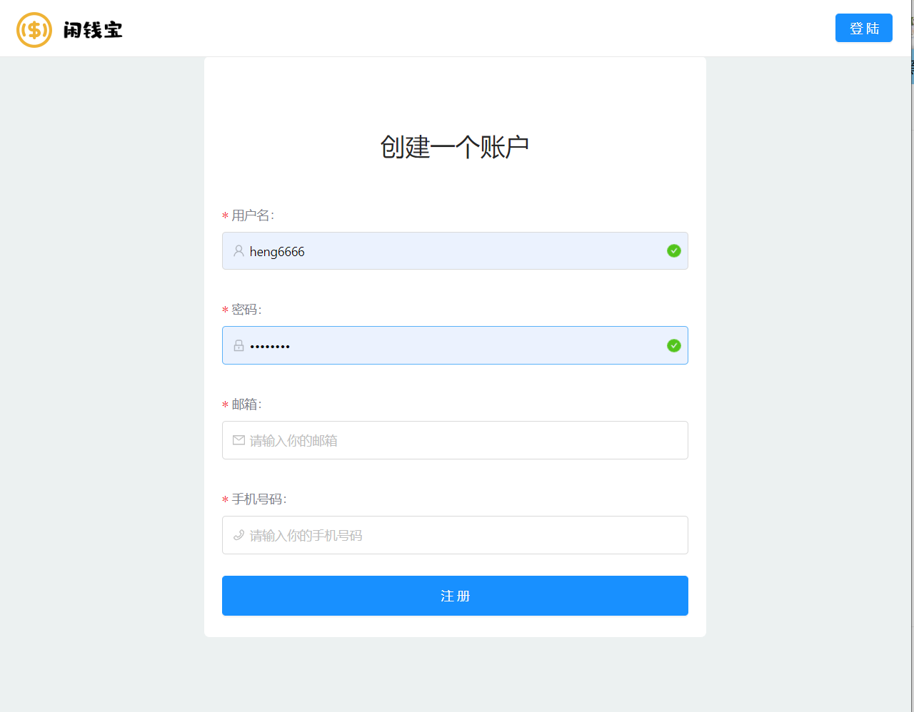
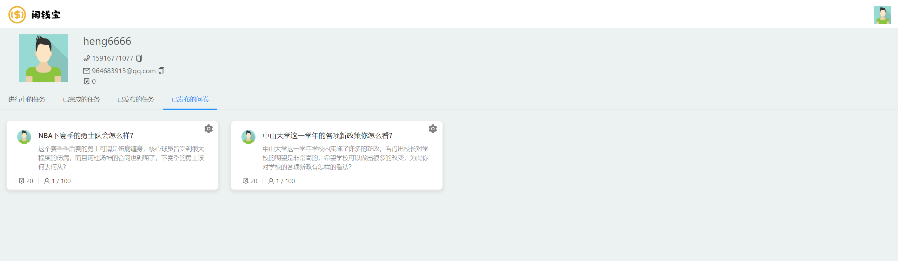
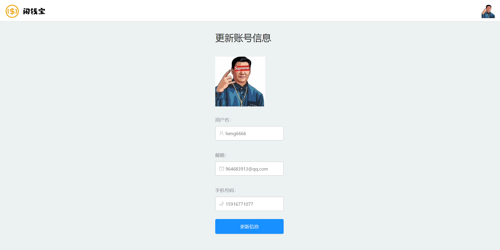
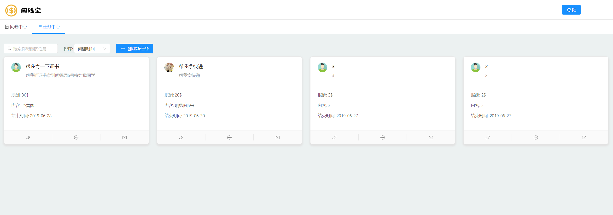
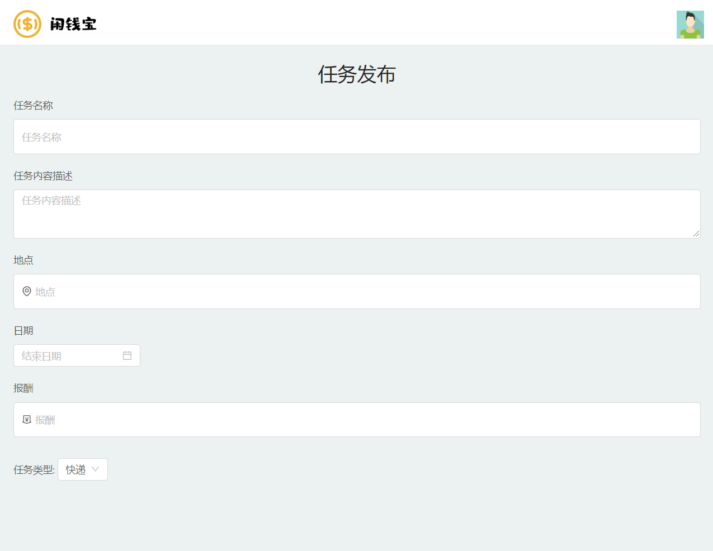
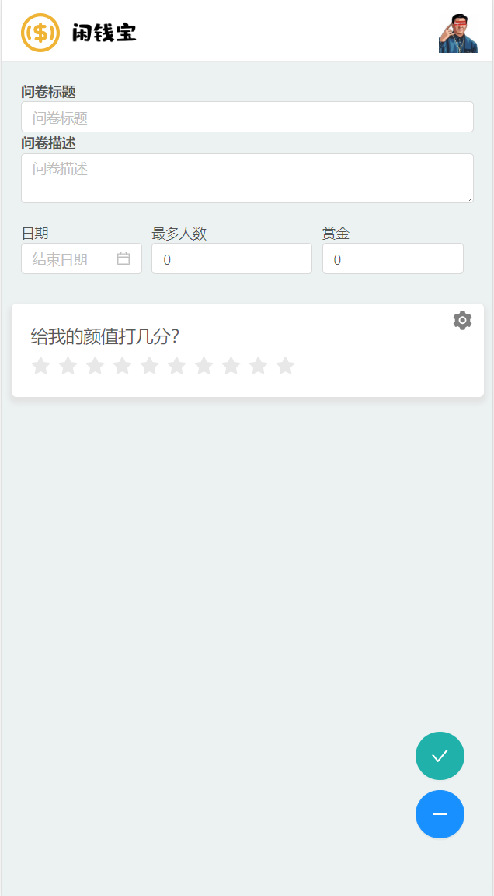
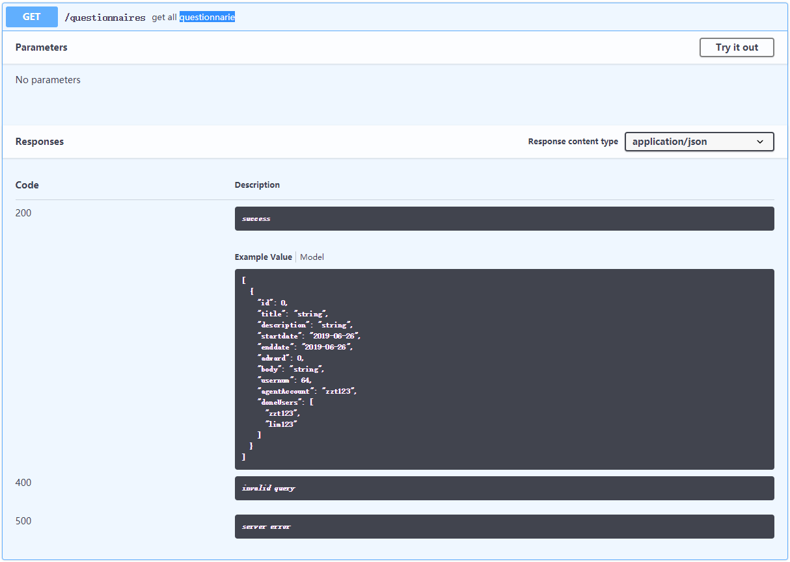

# 软件设计文档

|版本|日期|描述|作者|
-|-|-|-
v0.0|2019.5.14|初稿|章恒
v1.0|2019.5.27|完成API设计|章恒
v1.1|2019.5.28|完成数据库设计|章恒
v1.2|2019.6.23|完成模块设计、更新API设计|章恒
v1.3|2019.6.27|完成Server端的技术选型及理由、架构设计|朱俊凯
v1.4|2019.6.27|完成UI设计、更新架构设计|章恒

---
## 1. UI design
根据需求规格说明书（SRS）的补充需求，我们小组的UI设计由两个部分组成：**PC端**与**移动端**，根据不同的设备（PC还是移动设备）显示不同的UI内容。

### PC端挣闲钱UI设计

#### 账号相关
- 注册

    
- 登录

    
- 个人中心

    
- 更新用户信息

    

#### 问卷中心
- 问卷中心

    
- 填写问卷

    
- 创建新的问卷

    
- 管理问卷

    
- 删除问卷

    

#### 任务中心
- 任务中心

    
- 查看任务

    
- 发布新的任务

    
- 删除任务

    

---
### 移动端挣闲钱UI设计

#### 账号相关
- 注册

    
- 登录

    
- 个人中心

    
- 更新用户信息

    

#### 问卷中心
- 问卷中心

    
- 填写问卷

    
- 创建新的问卷

    
    
    
    
- 管理问卷

    
- 删除问卷

    

#### 任务中心
- 任务中心

    
- 查看任务

    
- 发布新的任务

    
- 删除任务

    

---
## 2. Database design

### ER图

---
## 3. Interface API design 

**User**
- 数据结构

    
- API设计

    
    
    
    
    

**Tasks**
- 数据结构

    
    
- API设计

    
    
    
    
    
    

**Questionnaires**
- 数据结构

    
- API设计

    
    
    
    
    
    
    

**Error**
- 数据结构

    

---
## 4. 技术选型及理由

### Client

打包工具：Webpack

> 理由

- webpack提供了Loader用于转换不同格式的文件，Plugin对转换过的资源进行处理，并且开发者可以自行实现Loader和Plugin，这种机制有助于自定义开发环境，提高开发效率
- webpack dev server是webpack内置的一个服务器，访问该服务器可以看到开发的页面，并且dev server提供了很多配置，例如：热更新、代理等，对页面的更改可以进行实时的变更并解决跨域问题
- webpack打包过程可以启用cache loader缓存打包的内容，DLL Plugin将一些不常变动的第三方库进行打包，对往后的打包速度有着极大的提升

开发框架：Vue

> 理由

- Vue框架关注视图层，对数据与DOM之间进行了绑定
- 单文件组件的编写方式与传统的方式相差不大，更加易于上手与使用
- 生态环境完善，Vue CLI提供了web开发的基础环境配置，并且提供了易于扩展配置的方法和一系列插件
- 在服务端渲染上有自己的工具链

应用特性：PWA、SSR，Modern Build

> PWA

- 不同于传统的HTTP缓存机制，PWA借助Service Worker保存在Cache Storage的缓存在用户离线时也能进行响应，而不是直接返回404页面
- 使用Service Worker可以在前端对请求的缓存策略做出更细粒度的划分
- 在用户访问过一次网址后，采用缓存优先的策略将不会有首屏加载过慢的问题
- 配置manifest.json文件可以让用户安装应用到桌面，让用户能够更快捷、更方便的使用，提供一种原生App的感觉

> SSR

- 服务端渲染可以很好的解决首屏加载慢、SEO不友好的问题
- 用户第一次访问网站，页面的渲染只需等待html、css的加载过程，比传统的SPA减少了js加载并执行生成DOM的过程，页面呈现速度更快，配合PWA的使用，最大程度上降低首屏问题

> Modern Build

- 现代模式构建打包能够提供两套不同的资源，一份是Babel转译过的，一份是没有转译的，对于浏览器版本更高的用户，无需下载转移过的冗余的代码，减少不必要的带宽浪费

### Server

开发环境：Nodejs

> 理由：node.js 是一个服务器端运行JavaScript脚本的环境
* 这个环境下保持了前端JavaScript的api一致
* 动态语言，开发效率非常高，并有能力构建复杂系统
* Nodejs非常好的解决了IO密集的问题，通过异步IO来实现。
* 单线程单进程模式促使程序执行上下文不需要向其他服务器端语言一样切换运行时上下文,运行状态加锁,解锁等操作
* 相关教程也比较成熟

开发框架：Express

> 理由：Express是基于node.js平台的web应用开发框架，可以实现快速搭建骨架
* 历史更久，文档更完整，资料更多
* 自带 Router、路由规则等
* express提供了一个快速生成工具 express-generator，可以帮助我们快速创建一个项目的工具

中间件：

> 理由： 中间件（middleware）就是处理HTTP请求的函数。它最大的特点就是，一个中间件处理完，再传递给下一个中间件。App实例在运行过程中，会调用一系列的中间件。
* 缩短应用的开发周期，本来由程序开发做的控制，通过中间件介入都给你做了。
* 降低开发的失败率，通过引入成熟的中间件，增加了软件应用开发的成功率
* 提高应用的开发质量
* 减少前期开发成本和维护费用

数据库：Sequelize

> Sequelize 是 Node 的一个 ORM(Object-Relational Mapping) 框架，用来方便数据库操作。
nodejs最强的就是他的异步编程和网络设计，Sequelize框架本身就是支持Promise的，默认的也是异步调用（当然也可以写成同步），另外一点就是Sequelize它支持方言PostgreSQL，MySQL，SQLite和MSSQL，并具有可靠的事务支持，关系，读取复制等功能

---
## 5. Architecture design（架构设计）

### Client

### Server

<strong>MVC架构</strong>

一种软件设计典范，用一种业务逻辑、数据、界面显示分离的方法组织代码，M是指数据模型，V是指用户界面，C则是控制器。使用MVC的目的是将M和V的实现代码分离，从而使同一个程序可以使用不同的表现形式，mvc模式的目的就是实现Web系统的职能分工。

模型(Model)：表示应用程序核心（比如数据库记录列表）。视图(View)：显示数据（数据库记录）。控制Controller)：控制器）处理输入（写入数据库记录）。MVC结合提供了对简单的HTML、css、java的完全控制。

优点：利于批量生产、层次分明,架构清晰、利于维护，利于写质量高的网站 

---
## 6. Module dividing（模块划分）

---
## 7. 软件设计技术

## 1. Structure Programming

我们在处理每个请求的顺序的时候，总体上是通过面向结构的思想处理的，也就是每个请求是通过一个个中间件或者处理函数处理的。

总体的处理过程如下：

1. 由监听器监听请求，请求到达，则根据请求的URL转交给对应的路由函数，
    
2. 对应的路由函数接着会调用预先注册好的处理函数，也就是controller, 在 controller里面执行相应的逻辑，
    
3. 包括对数据库数据的CRUD功能，
    
4. 之后再由controller返回结果给客户端
    

## 2. Object-Oriented Programming

在我们的项目中，同样用到了面向对象的设计技术，主要体现在：

1. 采用MVC模式奖处理过程的每个模块抽象成对象，每个对象都有自己的属性和方法，比如在model中每个模型有自己的属性，同时提供了findone, findAll 等方法供controller调用

    
    - 这一块是从总体结构上说明我们的面向对象的技术实现的，在代码文件组织中，我们就充分运用了面向对象的思想，通过MVC方法，更好的分解任务，是我们能够更好的理解任务。
2. 将model部分的各个对象用sequelize 模块将js对象映射到数据库中，使得我们可以直接操作model中的对象，操作数据库数据，同时，为每个model对象上增加了findone，findall 等CRUD方法。
    
    - 这一块表明我们将model中的实体的questionnaire抽象为一个对象， 其中包含title， question， description等属性，同时经过sequelize处理后变成sequelize的对象，加上CRUD的方法，这样questionnaire对象就有了属性和方法让上层功能模块调用

## 3. Design Patterns

在设计模式中，我们运用到了经典的单例模式。具体实现是我们在每个路由请求的路由函数和controller中，都只使用了一个controller来处理对应路径的请求，保证了只对一个对象操作，避免混淆。

具体代码如下：

