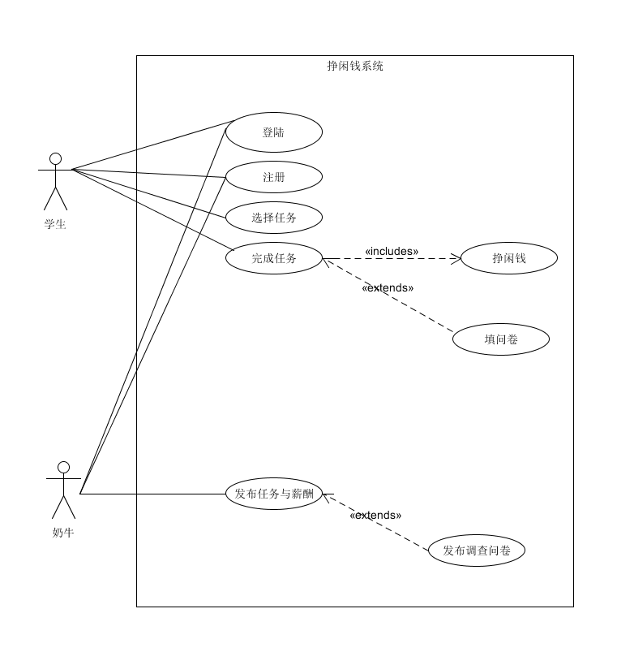
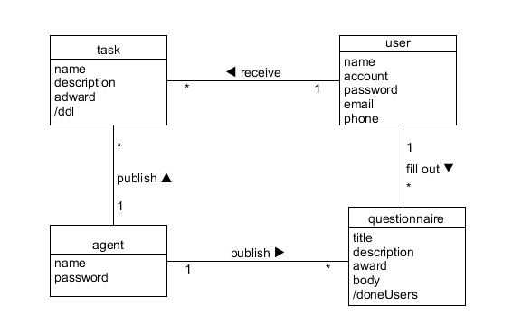
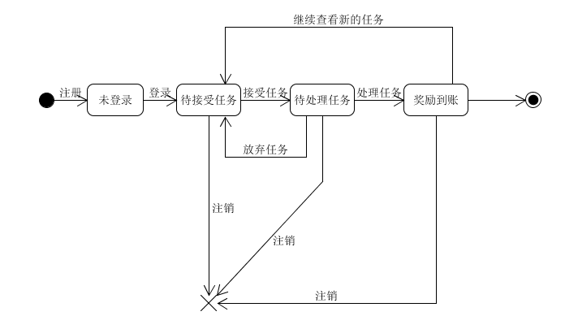
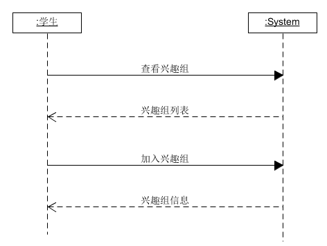

## Software Requirement specification（软件需求规格说明书）

### 1.用例图，业务过程/多泳道图
- 1.1 挣闲钱系统用例图

- 1.2 挣闲钱业务过程模型（多泳道图）
    - 场景1：奶牛发布问卷给学生用户填写并给予薪酬
    
    - 场景1：奶牛发布任务给学生用户完成并给予薪酬
    

---
### 2.用例文本与活动图

整个挣闲钱系统按照业务划分为下面几个**基本用例**，用例文本如下：
- **用户（学生，奶牛）注册**：奶牛或者学生用户注册系统。
- **用户（学生，奶牛）登陆**：奶牛或者学生用户用注册的账号登录系统。
- **奶牛发布问卷**：奶牛在问卷中心新建问卷，填写问卷的问题与薪酬，然后将问卷发布到问卷中心。
- **学生填写问卷**：学生在问卷中心查看可填写的问卷，选取感兴趣的问卷进行填写，并在填写之后获得相应的薪酬。
- **奶牛发布任务**：奶牛在任务中心新建任务，填写任务要求与薪酬，然后将任务发布到任务中心。
- **学生接受任务**：学生在任务中心查看可以接受的任务列表，选择接受其中感兴趣的任务，然后完成任务并获得相应的薪酬。
- **学生创建兴趣组**：学生创建属于自己的兴趣组。
- **学生加入兴趣组**：学生打开兴趣组页面查看已有的兴趣组列表，选择其中的任意感兴趣的兴趣组加入。
- **学生薪酬提现**：学生将自己赚取的薪酬通过微信平台提现到绑定好的微信账号之中。

**扩展用例**：
- **搜索问卷**：学生用户在问卷中心根据关键词搜索得到相关的问卷。
- **搜索任务**：学生用户在任务中心根据关键词搜索得到相关的任务。
- **按发布时间排序问卷**：学生用户在问卷中心对所有的可填写问卷按发布时间排序，
- **按发布时间排序任务**：学生用户在问卷中心对所有的可填写问卷按发布时间排序，

下面是`主成功场景`——**用户（学生，奶牛）注册**、**奶牛发布问卷**、**奶牛发布任务**、**学生填写问卷**以及**学生完成任务**的活动图。
- **用户（学生，奶牛）注册**

- **奶牛发布问卷**

- **奶牛发布任务**

- **学生填写问卷**

- **学生完成任务**

---
### 3.领域模型
- 3.1 挣闲钱系统用例进行领域模型

---
### 4.状态模型
- 4.1 学生对象状态模型

- 4.2 奶牛对象状态模型

---
### 5.功能模型
- 5.1 学生接受任务场景系统顺序图

- 5.2 学生填写问卷场景系统顺序图

- 5.3 学生加入兴趣组场景系统顺序图

- 5.4 奶牛发布任务场景系统顺序图

- 5.5 奶牛发布问卷场景系统顺序图

---
### 6.补充需求（非功能需求）
- 6.1 XX界面设计需求

- 6.2 人脸识别技术要求