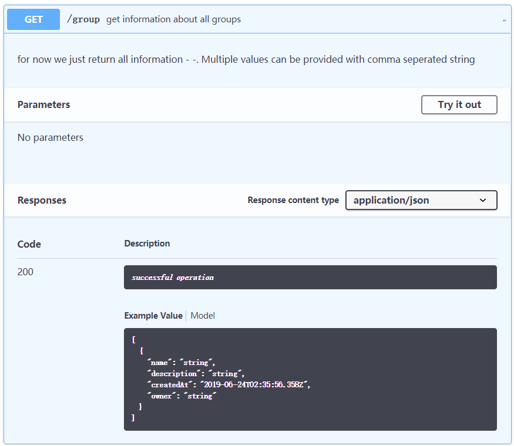
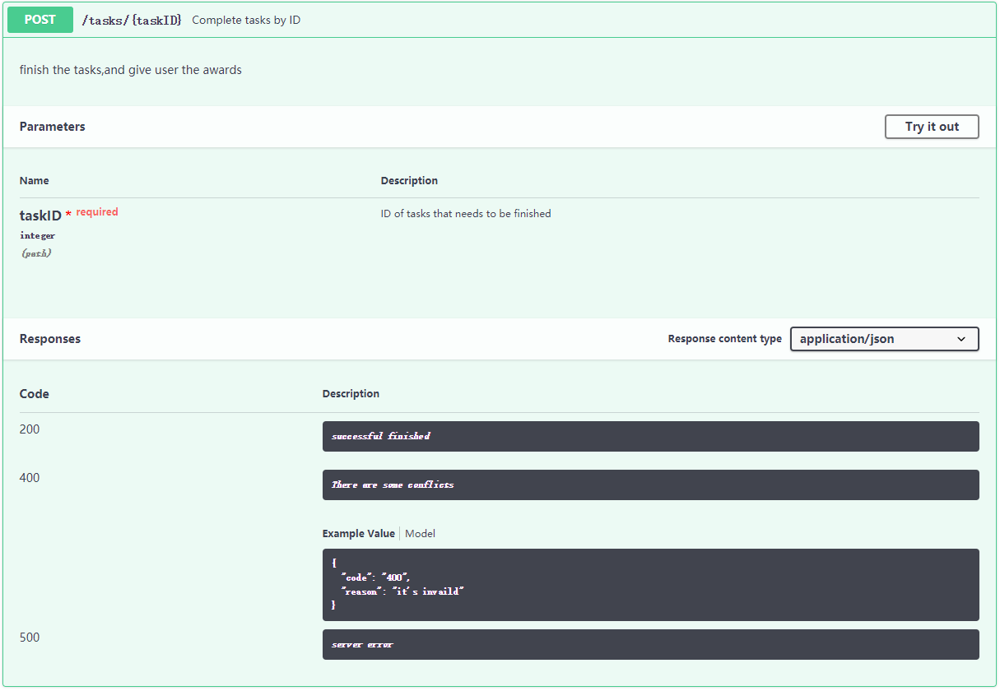
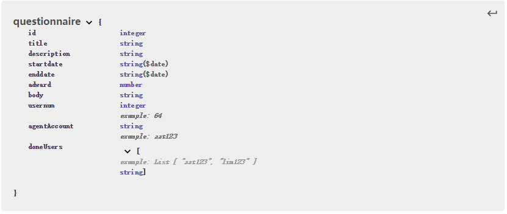

### Design（设计说明书）

---
#### 2. Database design
```sql
CREATE TABLE `users` (
  `account` varchar(255) NOT NULL,
  `name` varchar(255) DEFAULT NULL,
  `password` varchar(255) DEFAULT NULL,
  `email` varchar(255) DEFAULT NULL,
  `phone` varchar(255) DEFAULT NULL,
  `balance` double DEFAULT NULL,
  PRIMARY KEY (`account`)
) ENGINE=InnoDB DEFAULT CHARSET=latin1;
```

```sql
CREATE TABLE `tasks` (
  `id` bigint(20) unsigned NOT NULL AUTO_INCREMENT,
  `name` varchar(255) DEFAULT NULL,
  `award` double DEFAULT NULL,
  `description` varchar(255) DEFAULT NULL,
  `ddl` varchar(255) DEFAULT NULL,
  `usernum` int(11) DEFAULT NULL,
  `agentaccount` varchar(255) DEFAULT NULL,
  `complete` tinyint(1) DEFAULT NULL,
  PRIMARY KEY (`id`)
) ENGINE=InnoDB DEFAULT CHARSET=latin1;
```

```sql
CREATE TABLE `TaskundoUsers` (
  `task_id` bigint(20) unsigned NOT NULL,
  `user_account` varchar(255) NOT NULL,
  PRIMARY KEY (`task_id`,`user_account`)
) ENGINE=InnoDB DEFAULT CHARSET=latin1;
```

```sql
CREATE TABLE `TaskdoneUsers` (
  `task_id` bigint(20) unsigned NOT NULL,
  `user_account` varchar(255) NOT NULL,
  PRIMARY KEY (`task_id`,`user_account`)
) ENGINE=InnoDB DEFAULT CHARSET=latin1;
```

```sql
CREATE TABLE `TaskUsers` (
  `task_id` bigint(20) unsigned NOT NULL,
  `user_account` varchar(255) NOT NULL,
  PRIMARY KEY (`task_id`,`user_account`)
) ENGINE=InnoDB DEFAULT CHARSET=latin1;
```

---
#### 3. Interface API design 

**User**
- 数据结构

    
- API设计

    
    
    
    
    

**Group**
- 数据结构

    
- API设计

    
    
    

**Tasks**
- 数据结构

    
    
- API设计

    
    
    
    
    
    

**Questionnaires**
- 数据结构

    
- API设计

    
    
    


**Error**
- 数据结构

    

---