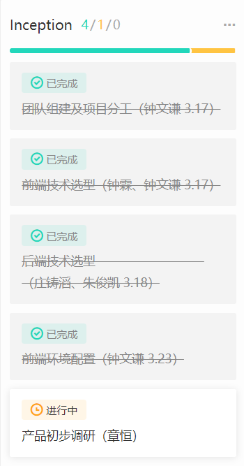
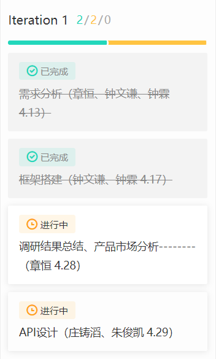
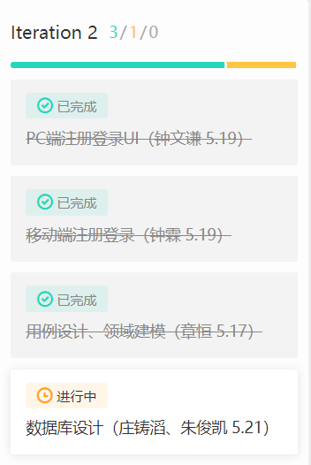
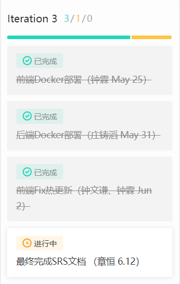
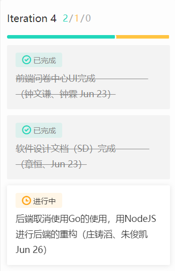
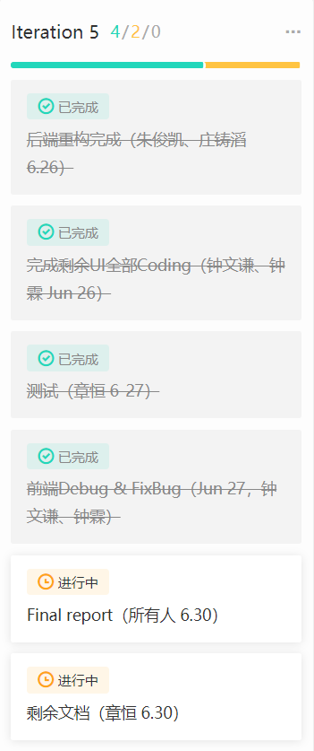

# About
> Records of earnsparemoney development progress.

## 1、项目简介

### Introduction

**闲钱宝**是大学生通过做任务挣钱的云平台，它属于以运营为中心的服务软件，也可以理解为面向大学生的专业“众包”系统。每个学生都装有“挣闲钱”客户端，可以是PC端或者移动端；一些机构或者有需求的学生用户，称为“奶牛”，他们提供任务给平台。基本业务如下：
- 奶牛发布任务要求与薪酬，系统推送到客户端，学生完成任务可获得系统内部的“闲钱币”，“闲钱币”可用于发布新的任务。这些任务可以是帮忙寄、拿快递，或者帮忙拿外卖、借用书籍等等。
- 奶牛发布问卷与薪酬，系统推送到客户端，学生填写问卷可获得系统内部的“闲钱币”，“闲钱币”可用于发布新的问卷。

### Team Division
- 项目经理: 章恒
- 客户经理：章恒
- 架构师：钟文谦、钟霖
- 开发工程师:
    - 前端：钟文谦、钟霖
    - 后端：庄铸滔、朱俊凯
    - 测试：钟文谦、钟霖、章恒

---
## 2、重要分析设计文档
- [需求规格说明书](SRS.md)
- [软件设计说明书](SoftwareDesign/SD.md)
- [部署说明](部署文档.md)
- [产品演示视频](http://www.iqiyi.com/w_19s8ul00bp.html)

---
## 3、敏捷开发迭代管理与大事纪

我们项目小组使用的看板是[Worktile](https://heti20190629102823258.worktile.com/mission/projects/5d173d86a3f61c3b135b34f0)

### Inceptions

**Week 3 (2019-3-17) Sunday**
- 团队组建及项目分工
- 产品初步调研
- 项目愿景
- 前端技术选型
- 后端技术选型
- 下一阶段开发计划
- 环境配置

### Iteration 1

**Week 9 (2019-4-27) Saturday**
- 需求分析
- 框架搭建
- 调研结果分析
- API设计

### Iteration 2

**Week 10-12 (2019-5-4 to 2019-5-19)**
- 代码规范
- 用例设计、状态建模与领域建模
- 数据库设计
- 注册登录UI设计

### Iteration 3

**Week 15 (2019-6-8) Saturday**
- 前后端Docker部署
- Finish 最终版SRS文档

### Iteration 4

**Week 17 (2019-6-23) Sunday**
- 前端-问卷中心部分UI基本完成
- 前端-任务中心部分UI初步完成
- 后端-重构，使用NodeJS替代Go重构后端
- 设计文档基本完成

### Iteration 5

**Week 18 (2019-6-30) Sunday**
- 剩余UI全部完成
- 测试
- 提交最终可交付制品
- 完成Final report 和 最后文档

