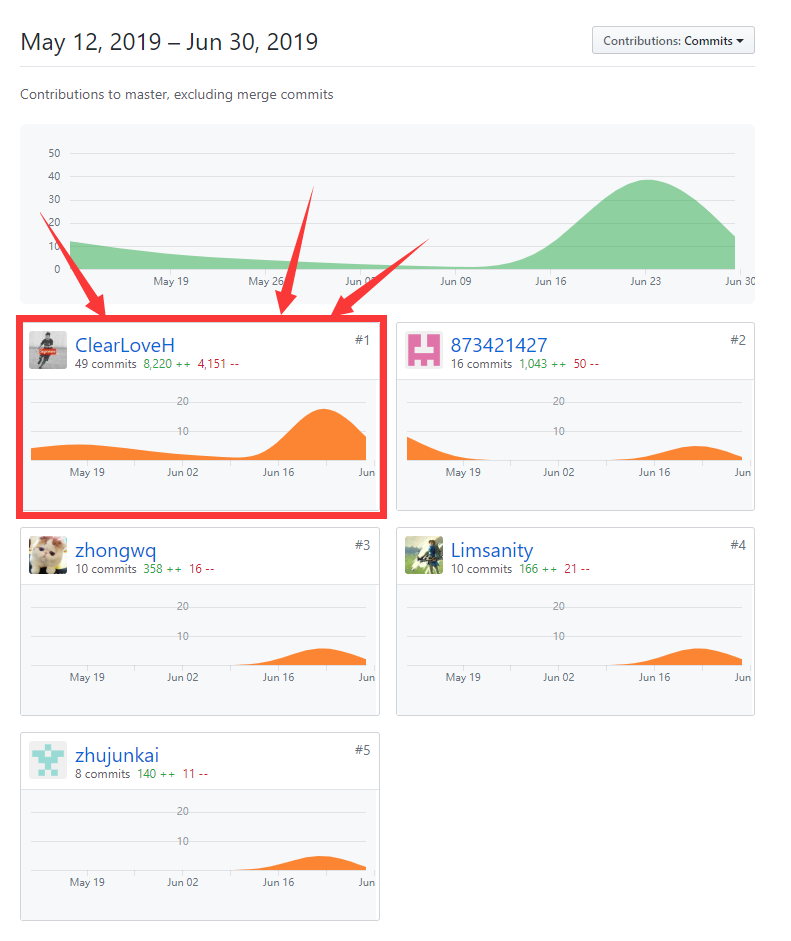

# 16340298-FinalReport

### 简短的课程学习自我总结

在这次系分的期末大项目中，我负责的部分是我们这个项目的需求分析、设计文档、测试以及其他项目文档的整理工作。

这次系分pro我没有参与到直接的编码过程，其实这也是我第一次在一个项目中完全的没有参与到Coding中，但是这并不意味着文档整理的工作是轻松的，其实经历了这两个月的整个项目的开发过程，我的收获是非常多的：
- 首先是我们小组的明确分工为我们的开发带来了许多的好处——2个同学负责前端开发，2个同学负责后端开发，而我辅助项目的需求分析与文档整理，大家明确分工的开发效率是非常高的，也我们近两个月的开发可谓是有条不紊，进度十分的明晰。
- 然后就是我第一次站在一个产品经理的角度来规划设计，很多东西对我来说都是十分新颖的，我对于一个项目的开发也有了一个全新的感知，这样对我以后参与软件的开发也是十分有帮助的。
- 最后就是我个人在做需求文档、设计文档等诸多文档的时候，是将系分这门课程的许多知识进行了活学活用的。像一些用例图、领域建模、状态建模，功能模块划分等等等等，这些都是我将系分课程所学直接进行了运用，整个项目下来也大大地加深了我对系统分析与设计的理解，收获颇丰、

最后就是感谢队友们的倾情付出，让这个项目也最终如愿完整的收工，两个月的大家的付出也终于是得到了收获，十分感谢组长还有队友们的贡献，大家都是很棒的。

---
### PSP-2.1 统计表

PSP阶段       | Personal Software Process Stages| Time (h) |
------------ | ------------------------------- | ----------------------- |
**Planning** | **计划** | 5 |
· Estimate  | 估计这个任务需要多少时间 | 5 |
**Development**  | **开发** | 66  |
· Analysis   | 需求分析 (包括对于新技术的学习) | 20 |
· Design Spec| 生成设计文档 | 15 |
· Design Review| 设计复审 (和同事审核设计文档)| 8 |
· Coding Standard| 代码规范 (为目前的开发制定合适的规范)| 0 |
· Design|具体设计| 10 |
· Coding|具体编码| 0 |
· Code Review| 代码复审| 0 |
· Test|测试（自我测试，修改代码，提交修改）| 13 |
**Reporting** | **报告** | 7 |
· Test Report | 测试报告 | 2 |
· Size Measurement | 计算工作量 | 2 |
· Postmortem & Process Improvement Plan| 事后总结, 并提出过程改进计划 | 3 |
**Total**|合计| 78

---
### 个人分支的 GIT 统计报告

**Git Pages文档**

我是我们小组主要负责文档管理的同学，所以主要的工作量都在文档的这部分。

### 自认为最得意/或有价值/或有苦劳的工作清单，含简短说明
- **项目前期调研（Investigation）**与**项目愿景（Vision）**，这两部分文档是我们小组的早期核心工作，我对市场上相关的主流产品进行了分析调研和对比，从而让我们闲钱宝**早期项目的定位得到了明确**。同时，分析得到的调研结果可以说是**指导了我们项目开发的需求分析与项目的大部分框架**，最后项目设计出的成品也与我们的项目愿景大致相符，这个调研过程也让我学到了不少的关于软件开发的早期准备工作相关的知识，我们小组早期的头脑风暴也都是关于调研结果的讨论，锻炼了我们小组大家的调研分析的能力。
- **软件需求规格说明（SRS，Software requirements specification）**，这部分文档是我一个人来完成的，在做SRS的时候，我同时也做了需求分析的工作，设计了基本用例、画了相关的活动图以及用例图、还有对我们的“闲钱宝”进行领域建模和状态建模，最后再完成功能模型和补充需求，这个文档算是我比较满意的工作，也是我将系分理论所学活学活用的地方。
- **软件设计文档（SDS）**，这部分可谓是PM及文档整理工作的另一大重心，也是我的工作量重点之一。这部分文档包括了UI设计、数据库设计、API设计、架构设计以及功能模块划分和技术选型及理由，这部分文档是我需要与前后端开发的四个同学们进行沟通和交流的，这部分文档也是大家一起完成的，最终SDS文档出来也是大家一起的心血，成品非常好的指导我们的开发工作，开发出的最后成品也是切合了设计文档的规划。
- **会议记录（Meet Records）**，我们小组这近两个月也开了不少会议，我也是对会议进行了记录，每次会议大家都会讨论出下阶段的工作目标与分工，让我们的项目进度可视。会议记录既做到了提出下一阶段的目标，不断的督促着大家，也给大家提供了另外的一种动力吧，会议记录也是十分重要的。

### 个人的技术类、项目管理类博客清单

- [使用Swagger Editor来设计和管理API文档](https://clearloveh.github.io/2019/06/23/SystemAnalysisandDesign-SwaggerEditor/)
- [《软件需求规格说明书》？](https://clearloveh.github.io/2019/06/24/SystemAnalysisandDesign-SRS/)
- [《软件设计文档》？](https://clearloveh.github.io/2019/06/25/SystemAnalysisandDesign-SD/)
- [功能模块划分](https://clearloveh.github.io/2019/06/26/SystemAnalysisandDesign-ModuleDesign/)
- [软件架构](https://clearloveh.github.io/2019/06/27/SystemAnalysisandDesign-ArchitectureDesign/)
- [设计模式——MVVM](https://clearloveh.github.io/2019/06/28/SystemAnalysisandDesign-MVVM/)

