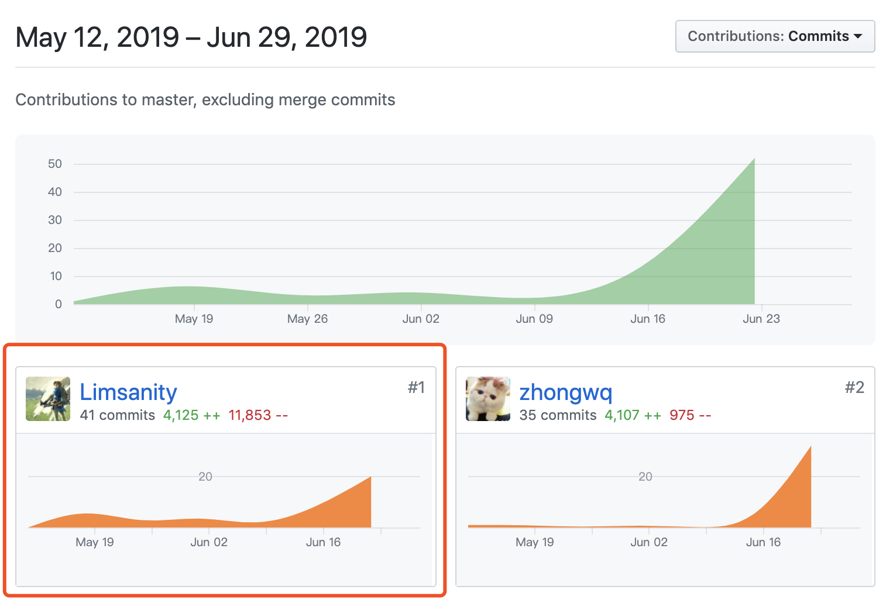

## 16340308-FinalReport

### 自我总结

在这次项目中，我主要负责的是前端技术选型、环境配置以及移动端界面布局和部分逻辑的实现。

该项目采用PWA、服务端渲染以及现代模式构建为核心的技术，力求提高首屏加载的速度，以及提升用户离线状态下的体验，在无网络的情况下应用可以正常返回页面并给出提示，而不会响应404页面。

除了技术选型上，环境搭建上也为了提高团队效率作出考虑，例如利用DLL抽离第三方库的方式提升构建速度。通过Vue CLI创建出来的环境远没有符合我们项目特性，在基础上添加了很多不同功能的配置，凭借npm脚本命令来一键提供运行或打包，让团队中其他成员更方便的开发。

在Vue CLI提供的项目规范上，我还利用husky在git hook中做了处理，对git信息做了一定的规范限制，不再是简单的git commit -m "…"，配合commitizen，为这种限制提供最简单的提交方式。

git flow方面主要有master和production分支，production分支为受保护分支，不能随意push，必须通过code review以及发起MR并接受同意才能进行代码合并。

### PSP 2.1统计表

| PSP2.1                                | Personal Software Process Stages      | Time (%) Senior Student |
| ------------------------------------- | ------------------------------------- | ----------------------- |
| **Planning**                          | **计划**                              | 10                      |
| Estimate                              | 估计这个任务需要多少时间              | 10                      |
| **Development**                       | **开发**                              | 80                      |
| Analysis                              | 需求分析 (包括对于新技术的学习)       | 8                       |
| Design Spec                           | 生成设计文档                          | 4                       |
| Design Review                         | 设计复审 (和同事审核设计文档)         | 5                       |
| Coding Standard                       | 代码规范 (为目前的开发制定合适的规范) | 5                       |
| Design                                | 具体设计                              | 10                      |
| Coding                                | 具体编码                              | 30                      |
| Code Review                           | 代码复审                              | 9                       |
| Test                                  | 测试（自我测试，修改代码，提交修改）  | 9                       |
| **Reporting**                         | **报告**                              | 10                      |
| Test Report                           | 测试报告                              | 0                       |
| Size Measurement                      | 计算工作量                            | 2                       |
| Postmortem & Process Improvement Plan | 事后总结, 并提出过程改进计划          | 8                       |

### 个人分支的Git统计报告

**EarnSpareMoney-frontend - 闲钱宝 前端**

### 自认为最得意/或有价值/或有苦劳的工作清单，含简短说明

- PWA的实现：Service Worker拥有缓存网络请求的特性，并且前端开发者可以拦截这些网络请求，对其响应采取不同策略的缓存，该缓存和传统HTTP缓存不同，即便离线也能够正常响应。在项目中，我通过Service Worker在安装过程预缓存必要的js、css等资源，并对这些资源采取缓存优先的策略，加速页面渲染的过程，在缓存处理上也做了特殊处理，做到用户在有网络并且资源发生变化的情况下也会拿到新的资源。加上manifest.json配置清单，使得我们的应用在用户访问时会弹出安装选项，让用户添加到主屏幕中，后续访问不再有浏览器中的url栏，提供原生app的体验。
- Modern Build的实现：现代模式构建是一个概念，对前端应用进行两次打包，一次通过babel进行处理，一次则不处理，如此可以获得两套资源。对浏览器版本较高的用户可以选择加载没有处理过的资源，而版本较低的则回退到处理过的资源以此支持跟高特性的js代码。这样做是为了减少一些不必要的带宽浪费，提升用户体验。
- SSR服务端渲染的配置及实现：在客户端和api服务器之间增设一个node中间层，负责页面的渲染以及请求。使用SSR能够解决首屏加载慢以及SEO不友好的问题，之前提到的PWA对首屏的处理是针对除第一次访问该网站的情况，而本项目中SSR是针对用户第一次访问页面而设的，SSR减少了等待js传输与加载并构建DOM的过程，以此提高首屏速度。将SSR和PWA相结合，能够最大程度在不同情况下提高首屏速度。SSR对Modern Build资源的选取是通过node中间层检测用户代理来决定的。
- 前端docker部署：SPA的Docker部署只需要一个Dockerfile，将webpack打包出来的文件拷贝至拥有nginx环境容器内，并设置nginx配置环境进行代理即可。而我们的项目用到了SSR，增加了一个node中间层，也就是多了个服务器，即整个docker环境有两个容器，因此采取docker-compose.yml文件进行配置，对外暴露nginx容器的端口，访问时再由nginx容器进行代理至node中间层。

### 个人的技术类、项目管理类博客清单

- [渐进式Web应用——PWA](https://limsanity.github.io/Web/渐进式Web应用PWA.html)
- [现代模式打包构建](https://limsanity.github.io/Web/%E7%8E%B0%E4%BB%A3%E6%A8%A1%E5%BC%8F%E6%89%93%E5%8C%85.html)
- [服务端渲染](https://limsanity.github.io/Web/%E6%9C%8D%E5%8A%A1%E7%AB%AF%E6%B8%B2%E6%9F%93%E5%BC%80%E5%8F%91%E8%AE%B0%E5%BD%95.html)
- [PWA、SSR、Modern Build的集成](https:///limsanity.github.io/Web/PWA、服务端渲染、现代模式构建的集成.html)

- [Docker容器化](https://limsanity.github.io/Web/Docker%E5%AE%B9%E5%99%A8%E5%8C%96.html)

- [webpack常见配置](https://limsanity.github.io/Web/webpack%E5%B8%B8%E8%A7%81%E9%85%8D%E7%BD%AE.html)

