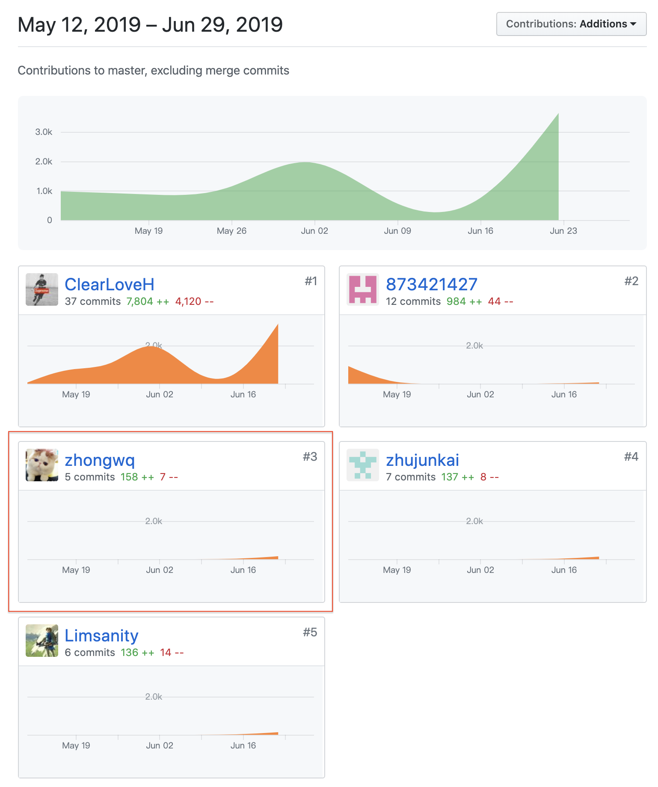

# 16340309-FinalReport

### 简短的课程学习自我总结

在本次课程项目中，我负责的主要的工作就是实现前端的一些需要实现PC端的界面(问卷填写页面)、后端接口调用的抽象出来的services，原有实现的移动端的页面对于PC端的适配还有主页相关的一些页面(问卷显示)，在开发的后期，参与一些后端的debug以及docker的部署。

在本次课程项目开发过程中，我了解到了项目开发的大致流程，包括需求分析，模块设计等。理解到需求分析在尽量详细的情况下我们才能更快的开发出产品。

除此之外，我也了解到开发的方法，以及一些协作开发的方法，如何使用github来有效管理我们的代码，如何在快速完成一次次迭代之后，根据需求或存在的问题调整结构，并在设计项目架构的时候，考虑项目的可维护性和可拓展性，对于一些应该被抽象的模块进行解耦，实现代码的高可复用性，方便之后迭代进行修改。

总的来说，本次的课程学习，让我了解到了关于整个软件开发生命周期的知识，特别是清楚了“分析”和“设计”，以及后期的“测试”在我们软件开发中的重要性。过去的学习更多只是教育我们如何进行开发，重点放在一些计算机相关的基础的理论以及知识，但系分课程则让我了解了开发一个软件绝不仅仅是打代码，还有其他的方便我们打代码的东西。让我们更好管理项目并进行开发。

### PSP 2.1 统计表

PSP2.1       | Personal Software Process Stages| Time (%) Senior Student |
------------ | ------------------------------- | ----------------------- |
**Planning** | **计划** | 10 |
Estimate  | 估计这个任务需要多少时间 | 10 |
**Development**  | **开发** |  80 |
Analysis   | 需求分析 (包括对于新技术的学习) | 8 |
Design Spec| 生成设计文档 | 4 |
Design Review| 设计复审 (和同事审核设计文档)| 5 |
Coding Standard| 代码规范 (为目前的开发制定合适的规范)| 5 |
Design|具体设计| 10 |
Coding|具体编码| 30 |
Code Review| 代码复审| 9 |
Test|测试（自我测试，修改代码，提交修改）| 9 |
**Reporting** | **报告** | 10 |
Test Report | 测试报告 | 0 |
Size Measurement | 计算工作量 | 2 |
Postmortem & Process Improvement Plan| 事后总结, 并提出过程改进计划 | 8 |

### 个人分支的 GIT 统计报告
**EarnSpareMoney-frontend - 闲钱宝 前端**

**EarnSpareMoney-backend - 闲钱宝 后端**

**Git Pages文档**

由于组内文档主要由一个同学负责，所以贡献不多

### 自认为最得意/或有价值/或有苦劳的工作清单，含简短说明

* 后端的docker部署: 由于后端用到了多个镜像，为了方便部署，我们决定进行docker-compose的打包，这部分比较麻烦，因为我们的nodejs服务镜像和mysql服务镜像存在依赖关系，不能直接使用depends-on, 这里需要一些处理，我的博客就有提到[后端项目容器化(依赖关系镜像中docker-compose书写)-DockerFile学习之路](https://zhongwq.github.io/SystemAnalysis/%E5%90%8E%E7%AB%AF%E9%A1%B9%E7%9B%AE%E5%AE%B9%E5%99%A8%E5%8C%96(%E4%BE%9D%E8%B5%96%E5%85%B3%E7%B3%BB%E9%95%9C%E5%83%8F%E4%B8%ADdocker-compose%E4%B9%A6%E5%86%99)-DockerFile%E5%AD%A6%E4%B9%A0%E4%B9%8B%E8%B7%AF/)
* 前端的多端适配: 由于Limsanity大佬把我们的前端定位为一个PWA应用，我们可以方便在手机上使用，我们前期都是以iphoneX(Chrome Devtools调为iphoneX来进行开发), 可能UI的显示在PC端上就没那么好，所以后面我决定对于一些方便使用css适配的资源使用css的@media进行适配，对于一些不方便的，使用常见的两套资源的处理方式，Client端的话通过navigator的userAgent进行查看，服务端渲染部分通过requset的header，详细的不一一说明，这些在下面的博客里就有[Vue前端多端适配初识](https://zhongwq.github.io/SystemAnalysis/%E5%89%8D%E7%AB%AF%E5%A4%9A%E7%AB%AF%E9%80%82%E9%85%8D%E5%88%9D%E8%AF%86/)

### 个人的技术类、项目管理类博客清单

  - [后端项目容器化(依赖关系镜像中docker-compose书写)-DockerFile学习之路](https://zhongwq.github.io/SystemAnalysis/%E5%90%8E%E7%AB%AF%E9%A1%B9%E7%9B%AE%E5%AE%B9%E5%99%A8%E5%8C%96(%E4%BE%9D%E8%B5%96%E5%85%B3%E7%B3%BB%E9%95%9C%E5%83%8F%E4%B8%ADdocker-compose%E4%B9%A6%E5%86%99)-DockerFile%E5%AD%A6%E4%B9%A0%E4%B9%8B%E8%B7%AF/)
  - [Vue前端路由鉴权的使用](https://zhongwq.github.io/SystemAnalysis/Vue%E5%89%8D%E7%AB%AF%E8%B7%AF%E7%94%B1%E9%89%B4%E6%9D%83%E7%9A%84%E4%BD%BF%E7%94%A8/)
  - [Vue前端多端适配初识](https://zhongwq.github.io/SystemAnalysis/%E5%89%8D%E7%AB%AF%E5%A4%9A%E7%AB%AF%E9%80%82%E9%85%8D%E5%88%9D%E8%AF%86/)
  - [Node.js Multer使用](https://zhongwq.github.io/SystemAnalysis/Node.js%20Multer%E4%BD%BF%E7%94%A8/)
  - [Node.js Joi使用](https://zhongwq.github.io/SystemAnalysis/Node.js%20joi%E4%BD%BF%E7%94%A8/)
  - [Mac下docker访问主机服务](https://zhongwq.github.io/SystemAnalysis/Mac%E4%B8%8Bdocker%E8%AE%BF%E9%97%AE%E4%B8%BB%E6%9C%BA%E6%9C%8D%E5%8A%A1/)

