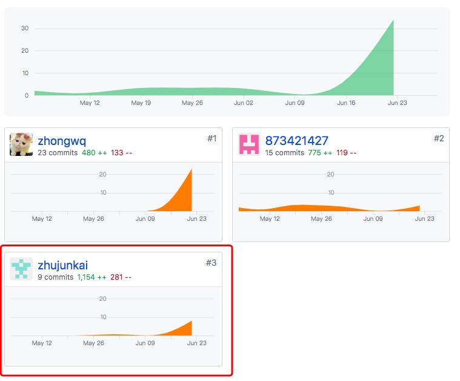
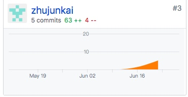

# 16340315-FinalReport
------

### 简短的课程学习自我总结

本次项目里面，我主要负责的是后端的一些service，根据项目前端的需求，对数据库的模型进行相关的设计，并设计了相应的路由接口和处理函数，返回合适的结果给前端。

在这次的项目中，大致的了解到了一个项目开发的过程，学习到了更加科学合理的开发流程，使得开发项目过程更加高效，更加可维护，可拓展等。

另外，合理的框架也十分重要，在好的框架下，就可以实现更好的代码管理，代码分工等等，在框架下，对代码进行了分层设计，于一些应该被抽象的模块进行解耦，实现代码的高可复用性，方便之后迭代进行修改。与此同时，组员之间的模块也互不干扰，从而实现了对项目的合作开发等等。

在这次的项目开发后，感觉学到了很多，对于用例建模，领域建模在项目开发中的用处也大有了解，对软件开发中的一些阶段的重要性也有所了解。深刻的明白了，单单提高代码能力是不够的，系分中学到的那些开发知识能大大的有助于我们项目的开发与管理等。

### PSP 2.1 统计表

 
PSP2.1       | Personal Software Process Stages| Time (%) Senior Student |
------------ | ------------------------------- | ----------------------- |
**Planning** | **计划** | 10 |
Estimate  | 估计这个任务需要多少时间 | 10 |
**Development**  | **开发** |  80 |
Analysis   | 需求分析 (包括对于新技术的学习) | 8 |
Design Spec| 生成设计文档 | 4 |
Design Review| 设计复审 (和同事审核设计文档)| 5 |
Coding Standard| 代码规范 (为目前的开发制定合适的规范)| 5 |
Design|具体设计| 10 |
Coding|具体编码| 30 |
Code Review| 代码复审| 9 |
Test|测试（自我测试，修改代码，提交修改）| 9 |
**Reporting** | **报告** | 10 |
Test Report | 测试报告 | 0 |
Size Measurement | 计算工作量 | 2 |
Postmortem & Process Improvement Plan| 事后总结, 并提出过程改进计划 | 8 |

### 个人分支的 GIT 统计报告

**EarnSpareMoney-backend - 闲钱宝 后端**

**Git Pages文档**

由于组内文档主要由一个同学负责，所以贡献不多

### 自认为最得意/或有价值/或有苦劳的工作清单，含简短说明

* JWT的实现：JWT是为了在网络应用环境间传递声明而执行的一种基于JSON的开放标准。该token被设计为紧凑且安全的，特别适用于分布式站点的单点登录场景。 
* 通过Sequelize建立使用数据库模型：Sequelize 是 Node 的一个 ORM框架，用来方便数据库操作。 Sequelize它支持方言PostgreSQL，MySQL，SQLite和MSSQL，并具有可靠的事务支持，关系，读取复制等功能
* Validator的实现：使用Validator能够将数据校验从业务代码中脱离出来，增加代码可读性，同时也让数据校验变得更加方便、简单。

### 个人的技术类、项目管理类博客清单

- [DockerFile学习](http://722king.cn/posts/%E7%B3%BB%E7%BB%9F%E5%88%86%E6%9E%90%E4%B8%8E%E8%AE%BE%E8%AE%A1/2019-06-29-Dockerfile.html#more)
- [nodejs multer学习](http://722king.cn/posts/%E7%B3%BB%E7%BB%9F%E5%88%86%E6%9E%90%E4%B8%8E%E8%AE%BE%E8%AE%A1/2019-06-29-multer.html#more)
- [nodejs log4js学习](http://722king.cn/posts/%E7%B3%BB%E7%BB%9F%E5%88%86%E6%9E%90%E4%B8%8E%E8%AE%BE%E8%AE%A1/2019-06-29-log4js.html#more)
- [validator 验证数据格式](http://722king.cn/posts/%E7%B3%BB%E7%BB%9F%E5%88%86%E6%9E%90%E4%B8%8E%E8%AE%BE%E8%AE%A1/2019-06-27-govalidator.html#more)
- [读取使用配置文件](http://722king.cn/posts/%E7%B3%BB%E7%BB%9F%E5%88%86%E6%9E%90%E4%B8%8E%E8%AE%BE%E8%AE%A1/2019-06-26-go-viper.html#more)
- [JWT实现Token认证](http://722king.cn/posts/%E7%B3%BB%E7%BB%9F%E5%88%86%E6%9E%90%E4%B8%8E%E8%AE%BE%E8%AE%A1/2019-06-26-go-echo-jwt.html#more)