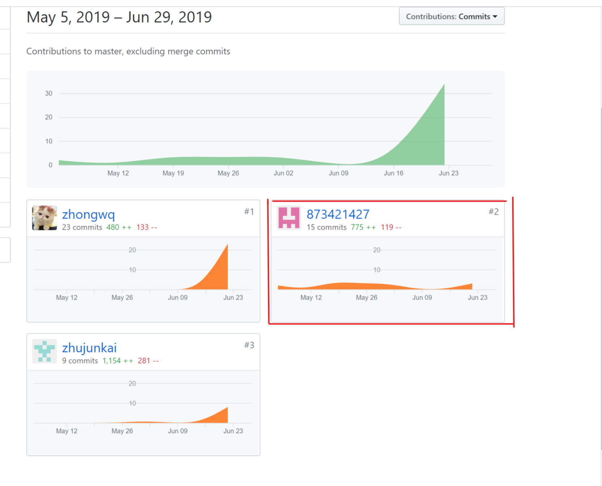
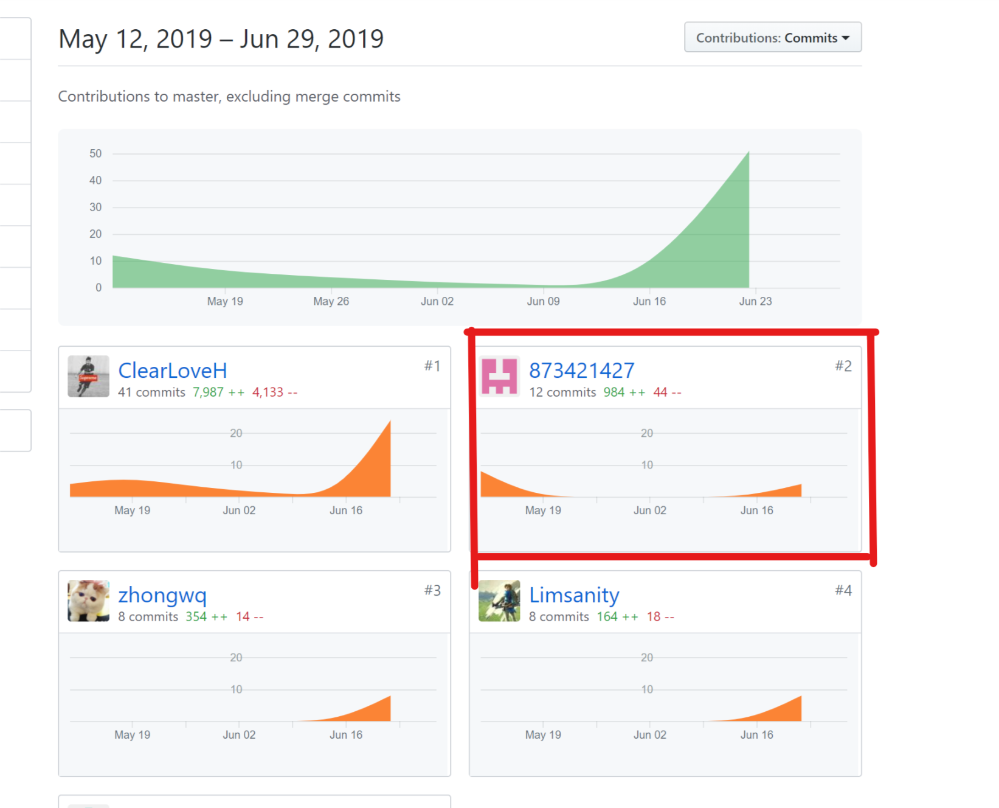

# 16340320-FinalReport

## 自我总结
本次项目里，我主要负责的是后端代码编写和API文档设计，对数据对象关系进行建模，并设计了相应的接口的返回数据格式。

本次项目的收获：
1. 获得了对一个项目实现的完整实践过程。在之前我做项目的时候，是对数据对象设计，需求分析和设计是没有概念，不知道如何构建一个产品，什么是构造一个软件的大致生产过程，在这个项目中，我用到了上课所学的用例分析，领域模型，系统顺序图等工具，帮助我更好的理解项目的实际需求和实践的要求。

2. 加深了我对go语言和orm的理解，在此之前，我对go语言知识有一个大概的了解，在项目中我们主要用go语言开发，对于go语言的接口和结构体有了更加深刻的理解。

3. 增加了对错误处理的方法的掌握，对于web应用来说，用一个中间件来捕获错误是非常合适的。

PSP2.1       | Personal Software Process Stages| Time (%) Senior Student |
------------ | ------------------------------- | ----------------------- |
**Planning** | **计划** | 10 |
Estimate  | 估计这个任务需要多少时间 | 10 |
**Development**  | **开发** |  80 |
Analysis   | 需求分析 (包括对于新技术的学习) | 8 |
Design Spec| 生成设计文档 | 4 |
Design Review| 设计复审 (和同事审核设计文档)| 5 |
Coding Standard| 代码规范 (为目前的开发制定合适的规范)| 5 |
Design|具体设计| 10 |
Coding|具体编码| 30 |
Code Review| 代码复审| 9 |
Test|测试（自我测试，修改代码，提交修改）| 9 |
**Reporting** | **报告** | 10 |
Test Report | 测试报告 | 0 |
Size Measurement | 计算工作量 | 2 |
Postmortem & Process Improvement Plan| 事后总结, 并提出过程改进计划 | 8 |

## 个人分支的git统计报告
**earnsparemoney-backend 后端git 记录**

**Git Pages 文档**

## 自认为最得意/或有价值/或有苦劳的工作清单，含简短说明
- 对模型的数据对象关系的设计，包括问卷，任务，用户对象之间数据关系的设计。
- 使用ORM 将对象和数据库表实体意义对应，简化数据操作难度。
- JWT的实现和使用，JWT降低了服务器保存会话状态需要的资源，节省了开销，为分布式应用的鉴权带来了便利。

## 个人技术类，项目类管理清单
- [Golang Docker部署实践](https://873421427.github.io/Golang%20Docker%E9%83%A8%E7%BD%B2%E5%AE%9E%E8%B7%B5.html#%E6%AD%A4%E6%95%99%E7%A8%8B%E9%9D%A2%E5%90%91docker%E6%96%B0%E6%89%8B)
- [Go 终于可以不翻墙下载golang.org 包了](https://873421427.github.io/Go%20%E7%BB%88%E4%BA%8E%E5%8F%AF%E4%BB%A5%E4%B8%8D%E7%BF%BB%E5%A2%99%E4%B8%8B%E8%BD%BDgolang.org%20%E5%8C%85%E4%BA%86.html)
- [Golang GORM使用](https://873421427.github.io/gorm%E5%85%A5%E9%97%A8%E5%92%8C%E5%AE%9E%E8%B7%B5.html)
- [goEcho和marini框架对比](https://873421427.github.io/goEcho%E5%92%8Cmarini%E6%A1%86%E6%9E%B6%E5%AF%B9%E6%AF%94.html)
- [gRPC入门](https://873421427.github.io/grpc%E5%85%A5%E9%97%A8.html)
