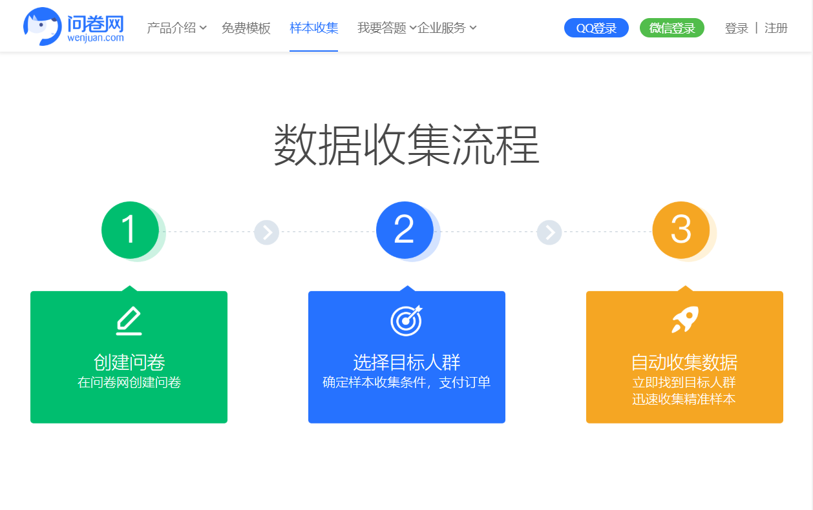
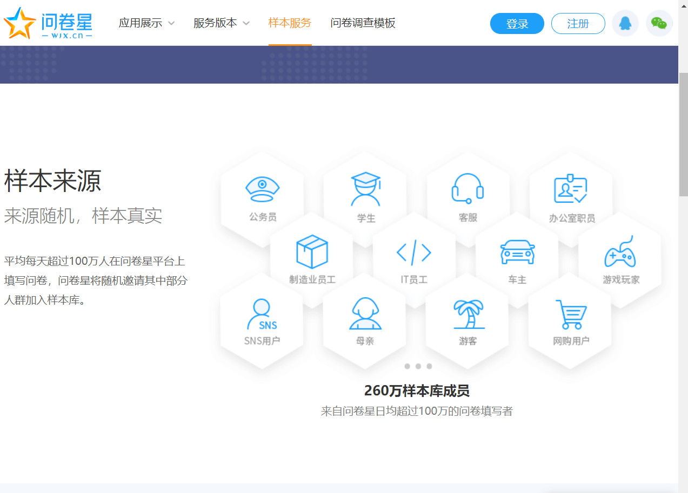
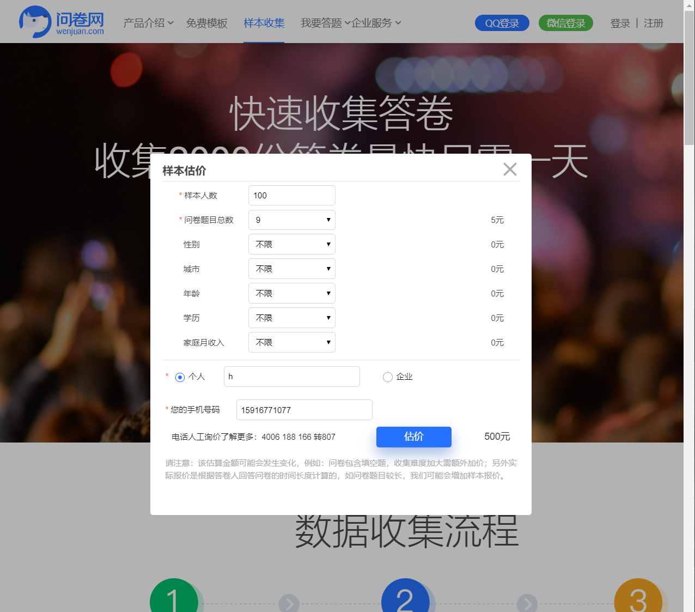
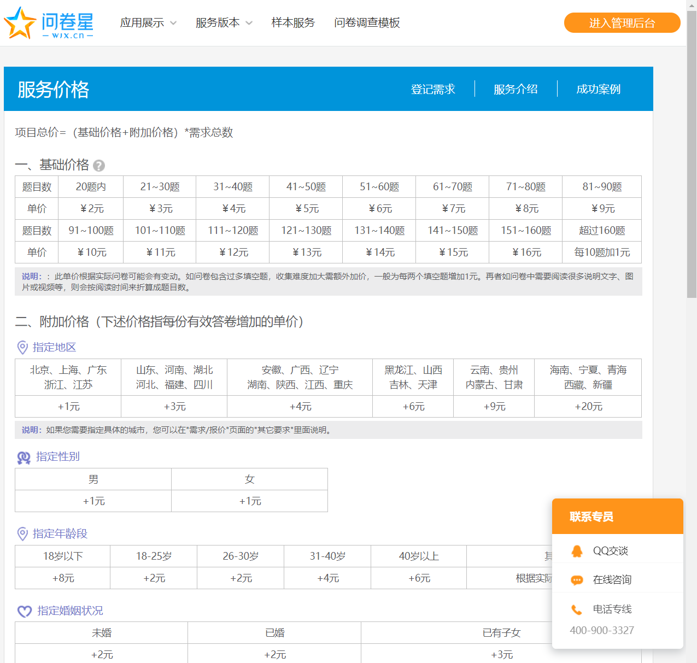

>根据我们小组初步讨论出的闲钱宝的产品定位与需求，我们需决定对主流的**问卷调研平台**的相关产品进行调研分析，从而更好地明确我们项目的定位，进行设计与规划。

# 闲钱宝项目前期调研

## 背景
信息时代的大学生，闲余时间充足，许多同学对这部分的时间都不知道该如何正确地规划，再加上短讯息、短视频类的APP风靡全国，许多人都将碎片化时间花费在了这些应用之上，对于该如何帮助学生用户将碎片化的时间充分利用，同时从中赚取一些小额薪酬、达到“挣闲钱”的目的，是我们小组所思考的问题。

问卷调研一直是大学里许多项目的一种重要的前期调研方式，在一些中小型企业里，问卷也是他们分析市场和用户需求的一种重要信息来源。诸如`问卷星、调查派`这类平台都有提供基本的发布问卷的功能，但不是重点，重点在于**该如何通过问卷从目标用户中收集我们所需的信息**。而上述平台在数据获取方式、目标用户群体，以及数据图表分析都各有各自的特点，但这些功能都是面向企业的、样本需求大的用户，对于学生群体的微调研，这些大平台的数据收集显得十分昂贵。

另一方面，学生在通过问卷做微调研时，发布问卷的方式往往是通过社交平台转发群聊，再加上一点的群红包来收集问卷，这样得到的收集结果往往因为面向群体单一、填问卷的对象为了完成任务而不是真正感兴趣等原因，质量不高，无法得到较好的、普适性较高的分析结果。我们闲钱宝就是针对这样的市场状况而横空出世，既可以**针对学生用户群体，让学生用户的碎片时间得到充分利用，可以“挣闲钱”；同时也可以满足机构或个人的微调研的问卷发布及样本采集需求，又可以做到满足单个个体的任务发布需求**。

还有一点，外卖以及线上购物在这几年的逐渐成熟，让我们大学生用户的拿外卖与快递的频次逐渐增加，但也总会遇到没时间的情况需要请求他人帮助。我们的闲钱宝项目也考虑到了这样的一类需求，将任务的发布与问卷的发布整合进闲钱宝之中，为的就是同时满足以上用户群体的不同需求。下面我们通过对一些大平台的相关业务进行分析，为闲钱宝整合出相关的模式与标准的参考，同时更好明确我们产品的定位。

## 主要平台的交互设计与标准分析
因为大多数问卷发布平台的相关交互都不多，功能框架大致相同，就不做功能架构分析。

针对闲钱宝的核心业务，我们挑选了`问卷网`、`调查派`，`问卷星`三款竞品做了相应的**交互设计与相关标准**的对比分析。它们的核心流程的界面截图在附录给出。

### 问卷发布交互界面
- 问卷网

    
- 调查派

    
- 问卷星

    

### 数据样本来源
- 问卷网

    
- 调查派

    
- 问卷星

    
### 收费标准
- 问卷网

    
- 调查派

    
- 问卷星

    

### 分析
这类大型的问卷发布平台设计问卷的格式大抵相同，这也是我们小组去设计UI交互时值得参考的地方，但是因为闲钱宝的定位并不需要这么复杂的交互，所以我们也需对相关问卷逻辑的设计进行精简，留下几类核心的问卷题型即可。

另外，我们可以看到，这些大平台针对的目标用户群体都是`有大量样本需求的大型调研组织或者机构`，它们的样本数据来源都是规模化的，通过大数据将问卷定向投入到设定的目标人群之中；但也同样的，服务价格也是比较高昂的，这些问卷发布平台并没有去考量到`小规模调研和学生用户发布问卷的需求`。分析完这些大平台的调研结果，也让我们闲钱宝的定位更加明晰——**主打轻量级的、针对学生用户群体的问卷/任务发布平台。**

## 总结
综合前面所分析的主流问卷发布平台，我们闲钱宝的UI和逻辑设计可以取其精华来作为参考，为的就是让用户在使用闲钱宝时可以有最好的体验。

除了调查派，另外两个平台的问卷都提供不同设备自适配不同UI的功能，同一份问卷在不同设备上有不同的Design，这也是我们闲钱宝在本次调研之后，决定的后续设计的时候需要完成的一个功能。

通过分析这类大型平台的市场和定位，我们也更好的明确闲钱宝自己的定位与目标用户群体，从而让相应需求的分析也得以开展。结合我们日常生活中的种种相关场景，我们认为闲钱宝作为迷你型的、针对大学生用户群体的任务与问卷发布平台的的确确是大有可为的，因为这块市场目前来说还没有一个好的应用来填补空缺，大家都还在使用原始的问卷样本收集方式，所以我们对闲钱宝以后的发展还是很有信心的，也希望可以把它做成一个很好的产品。

## 附录

- **问卷网**  发布问卷流程

    
    
    
    
    

- **调查派**  发布问卷流程

    
    
    
    
    

- **问卷星**  发布问卷流程

    
    
    
    
    
    
    