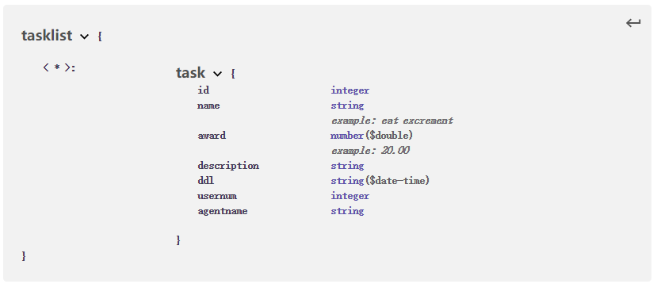
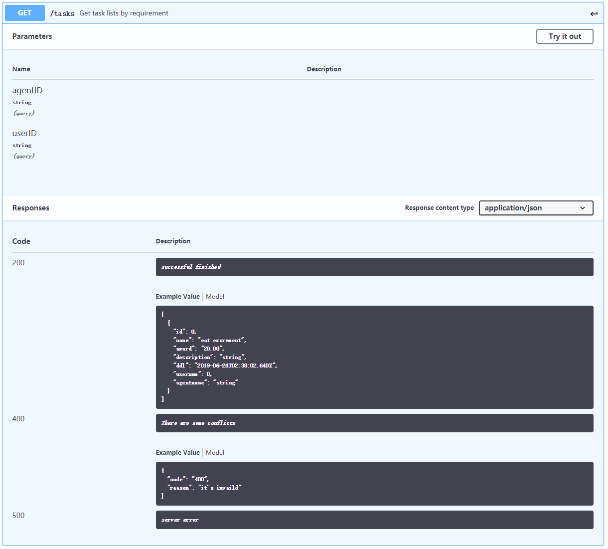
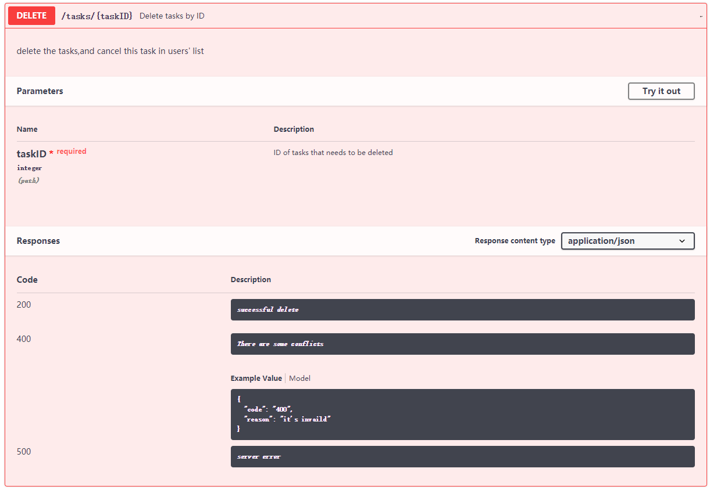
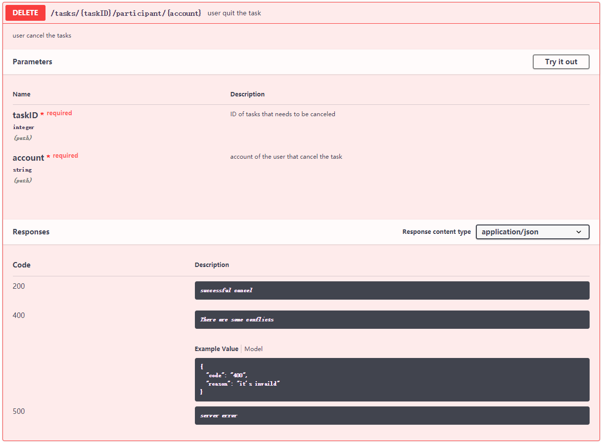
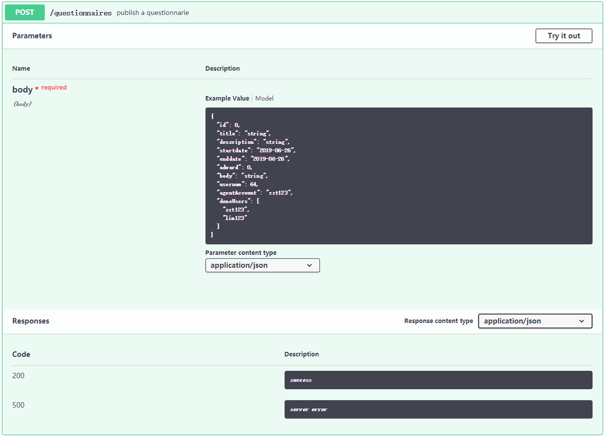
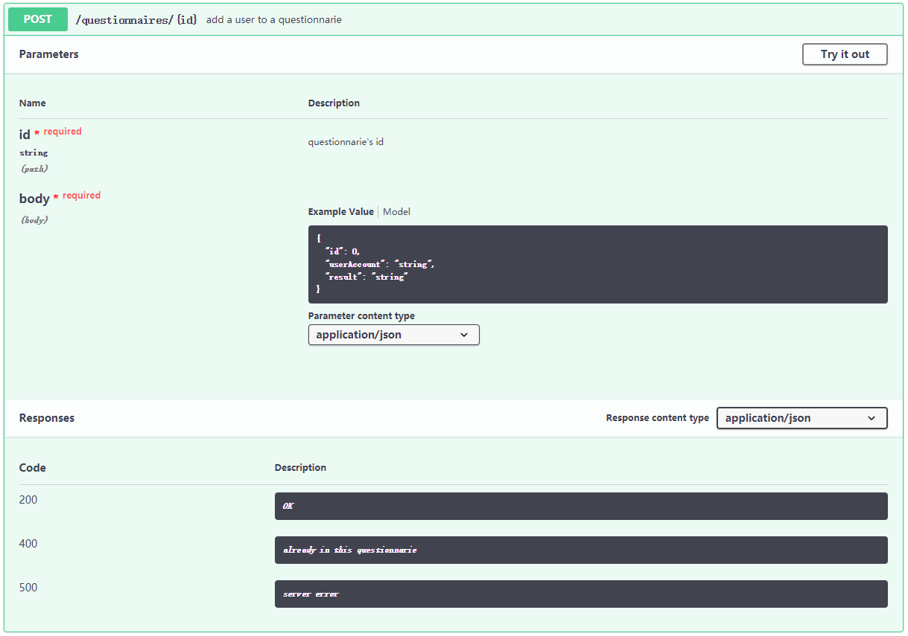
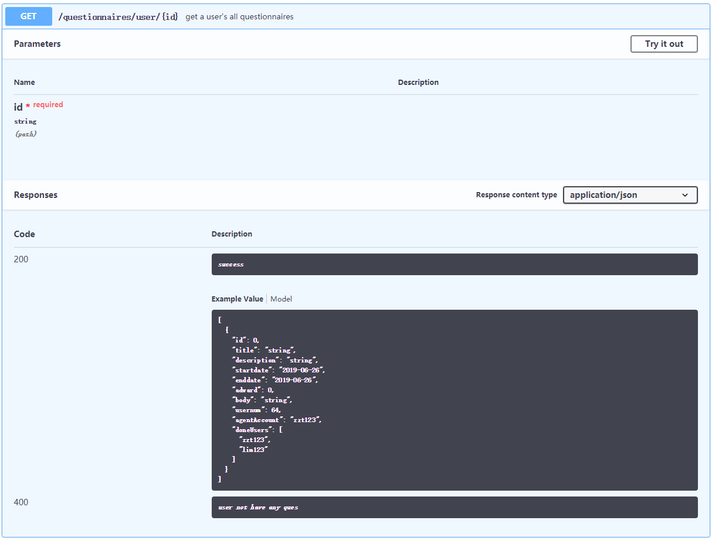

# Interface API design 

**User**
- 数据结构

    
- API设计

    
    
    
    
    

**Tasks**
- 数据结构

    
    
- API设计

    
    
    
    
    
    

**Questionnaires**
- 数据结构

    
- API设计

    
    
    
    
    
    
    

**Error**
- 数据结构

    