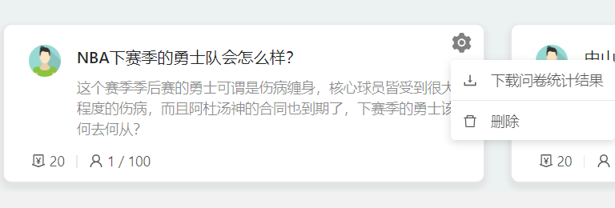

根据需求规格说明书（SRS）的补充需求，我们小组的UI设计由两个部分组成：**PC端**与**移动端**，根据不同的设备（PC还是移动设备）显示不同的UI内容。

# PC端挣闲钱UI设计

## 账号相关
- 注册

    
- 登录

    
- 个人中心

    
- 更新用户信息

    

## 问卷中心
- 问卷中心

    
- 填写问卷

    
- 创建新的问卷

    
- 管理问卷

    
- 删除问卷

    

## 任务中心
- 任务中心

    
- 查看任务

    
- 发布新的任务

    
- 删除任务

    

