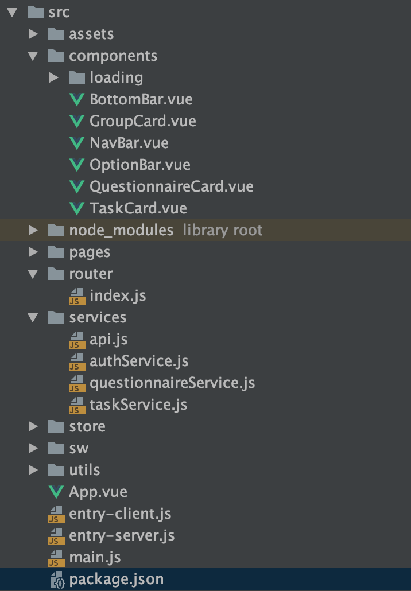

# Architecture design（架构设计）

## Client

前端的架构设计

我们按照我们前端的源码的文件目录讲一讲我们的前端的架构的设计，讲一讲我们前端的架构设计，我们可以看到我们前端主要的文件目录为

* components(公共组件目录)
* router(路由目录)
* pages(各个页面单文件文件的目录)
* services(调用后端接口的抽象成service的接口)

而我们项目的基本架构就是通过router判断用户访问的页面，从而选择router中对应的页面进行渲染并挂载，而我们的页面使用我们抽象出来的公共组件并使用我们的services提供的接口，这就是我们项目的基本的结构

### 可维护性和可拓展性的分析

该结构无论可维护性和可拓展性都很好，实现了非常良好的解耦，当我们需要对某一个模块进行修改时，我们可以通过判断该模块属于那个部分，对那部分的文件进行修改即可，而当我们需要拓展时，我们只需要添加模块于他的部分，然后其他使用到他的部分使用impor把其导入，就可以使用了。我们以页面添加为例，当我们需要添加页面时，我们可以把写好的单页面文件放到pages中，然后在router.js中添加对应的路由信息，我们的新页面就完成了，我们在该架构下能较好完成维护和拓展

下面我们说说我们前端另一个功能的架构

该应用具有PWA、服务端渲染以及现代模式打包构建特性，PWA能够利用Service Worker对网络请求进行响应，在离线状况下也能正确将页面呈现，并且能够提供安装的功能将应用添加到桌面。结合PWA和服务端渲染能够最大程度加快页面呈现速度，当用户第一次访问页面时，采用服务端渲染进行响应，该页面无需等待Vue等运行时代码的加载即可呈现给用户，此外首次访问时利用Service Worker对资源进行与缓存，用户在以后访问时只需请求一个只有几kb的html文件，其余资源利用Cache Storage的缓存进行响应可以减少HTTP网络请求耗费的时间，使得页面可以立刻进行DOM的创建并渲染。结合服务端渲染和现代模式构建，通过用户代理决定返回给用户的资源是否通过babel进行转译，以此节省用户带宽。

---
## Server

node+express 后端分层设计，切片设计，架构设计如下：
* config文件夹：包含程序的配置数据
* controllers文件夹：包含接口请求时数据处理的方法
* models文件夹：包含所有的对象模型
* policies文件夹：包括一些文件数据检验的策略
* utils文件夹：包含所有的公共方法和数据返回统一控制方法
* routes文件：包含所有的路由规则

把各个功能按调用流程进行了模块化，模块化带来的好处就是可以随意组合，把不同部分的代码放在各自独立的方法或类中编写，这样就不会出现牵一发而动全身的问题了。处在高层次的系统仅是利用较低层次的系统提供的接口和功能，不需了解低层实现该功能所采用的算法和协议；较低层次也仅是使用从高层系统传送来的参数，这就 是层次间的无关性。因为有了这种无关性，层次间的每个模块可以用一个新的模块取代，只要新的模块与旧的模块具有相同的功能和接口，即使它们使用的算法和协议都不一样。

在增加或删除一个模块后，可以在routes里修改其对应的路由法则，在models中增删其对应的对象模型，再在Controllers里增删相关的数据处理方法即可；当数据库等环境改变时，只需要修改config配置信息即可；一些公共的方法函数，放在utils文件夹中，只用修改一个文件，就可也使相关的所有功能发生对应的变化。

好处：
* 实现了软件之间的解耦；
* 便于进行分工
* 便于维护
* 提高软件组件的重用
* 便于替换某种产品
* 便于产品功能的扩展
* 便于适用用户需求的不断变化
