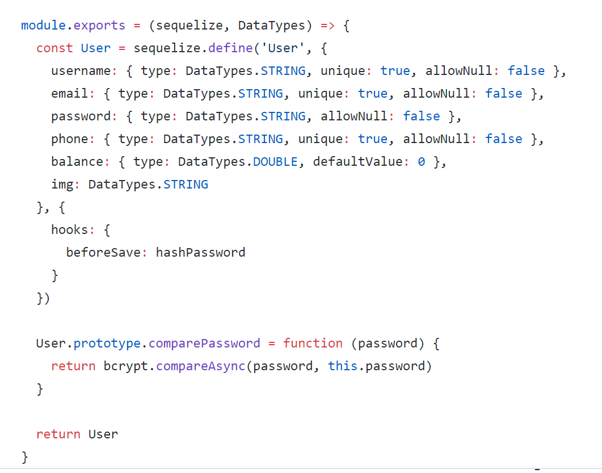
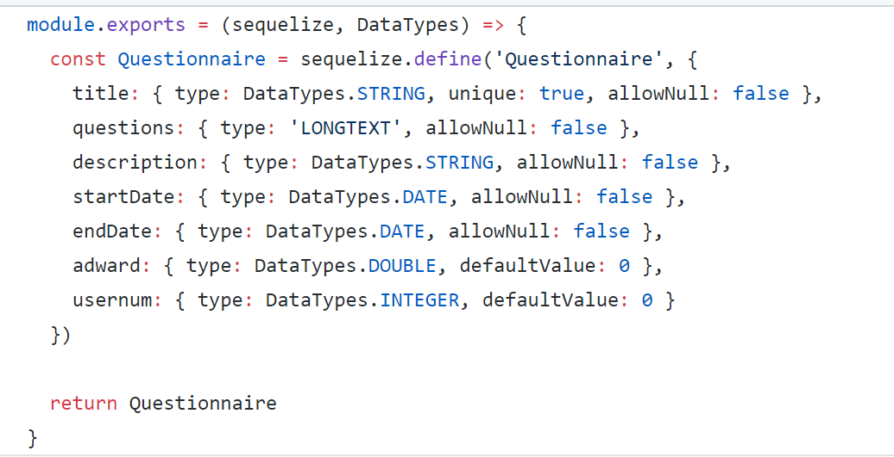
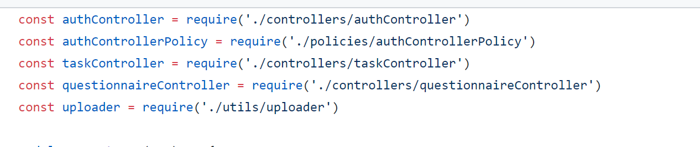
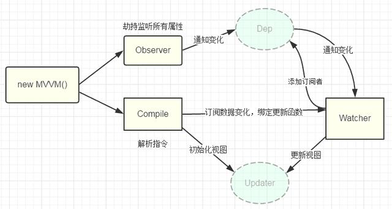

# 软件设计技术

## Structure Programming

我们在处理每个请求的顺序的时候，总体上是通过**结构程序设计**的思想处理的，也就是每个请求是通过一个个中间件或者处理函数处理的。

总体的处理过程如下：

1. 由监听器监听请求，请求到达，则根据请求的URL转交给对应的路由函数，

    
2. 对应的路由函数接着会调用预先注册好的处理函数，也就是controller, 在 controller里面执行相应的逻辑，

    
3. 包括对数据库数据的CRUD功能，

    
4. 之后再由controller返回结果给客户端

    

---
## Object-Oriented Programming

在我们的项目中，同样用到了**面向对象的设计技术**，主要体现在：

1. 采用MVC模式将处理过程的每个模块抽象成对象，每个对象都有自己的属性和方法，比如在model中每个模型有自己的属性，同时提供了findone, findAll 等方法供controller调用

    
    
    - 这一块是从总体结构上说明我们的面向对象的技术实现的，在代码文件组织中，我们就充分运用了面向对象的思想，通过MVC方法，更好的分解任务，是我们能够更好的理解任务。
2. 将model部分的各个对象用sequelize 模块将js对象映射到数据库中，使得我们可以直接操作model中的对象，操作数据库数据，同时，为每个model对象上增加了findone，findall 等CRUD方法。

    
    
    - 这一块表明我们将model中的实体的questionnaire抽象为一个对象， 其中包含title， question， description等属性，同时经过sequelize处理后变成sequelize的对象，加上CRUD的方法，这样questionnaire对象就有了属性和方法让上层功能模块调用

---
## Design Patterns

### 单例模式
在设计模式中，我们运用到了经典的**单例模式**。具体实现是我们在每个路由请求的路由函数和controller中，都只使用了一个controller来处理对应路径的请求，保证了只对一个对象操作，避免混淆。具体代码如下：
    

### MVVM

MVVM是`Model-View-ViewModel`的简写，本质上就是MVC的改进版。MVVM就是将其中`View的状态和行为抽象化`，让我们将**视图UI和业务逻辑分开**。
- **Model**：应用程序中用于处理`应用程序数据逻辑`的部分，它主要负责网络请求，数据库处理，I/O等的操作。
- **View**：应用程序中处理数据显示的部分。View层负责处理UI相关的工作，我们不在View层写业务逻辑和业务数据相关的代码。
- **ViewModel** ：创建关联，将Model和View绑定起来。这样，一旦Model发生更改，ViewModel就会立即反馈给View从而自动刷新界面。ViewModel只负责业务逻辑，`不做任何和UI相关的事情`。更新UI通过数据绑定实现，尽量在ViewModel里面做

而我们所采用的Vue.js就是典型的MVVM框架，Vue的MVVM实现原理如下：

- 当执行 new Vue() 时，Vue 就进入了`初始化阶段`，一方面Vue 会遍历 data 选项中的属性，并用 Object.defineProperty 将它们转为 getter/setter，实现`数据变化监听功能`；另一方面，Vue 的指令编译器Compile 对元素节点的指令进行扫描和解析，初始化视图，并订阅Watcher 来更新视图， 此时Wather 会将自己添加到消息订阅器中(Dep),初始化完毕。
- 当数据发生变化时，Observer 中的 setter 方法被触发，setter 会立即调用Dep.notify()，Dep 开始遍历所有的订阅者，并调用订阅者的 update 方法，订阅者收到通知后`对视图进行相应的更新`。

