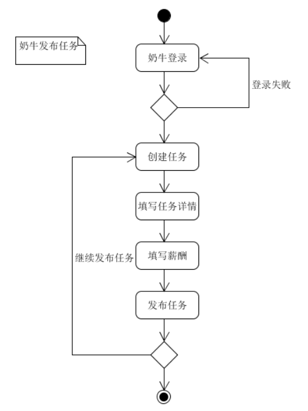
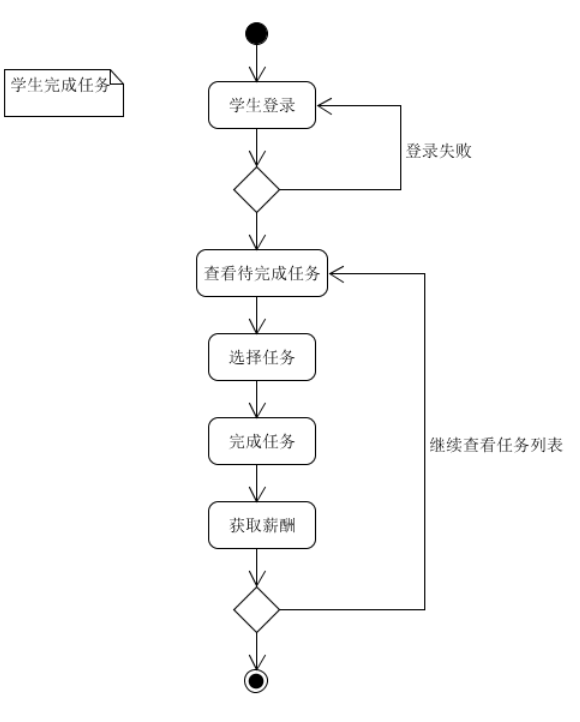
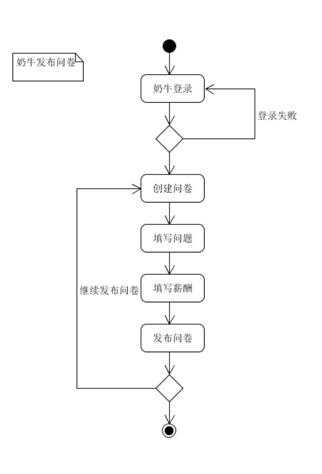
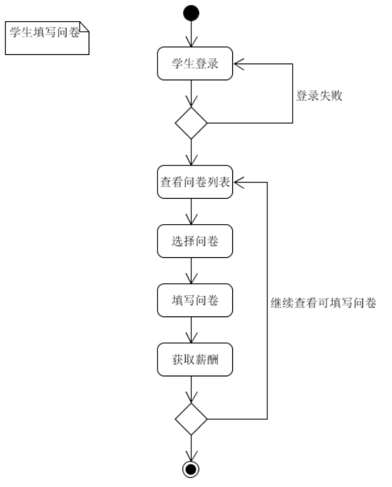
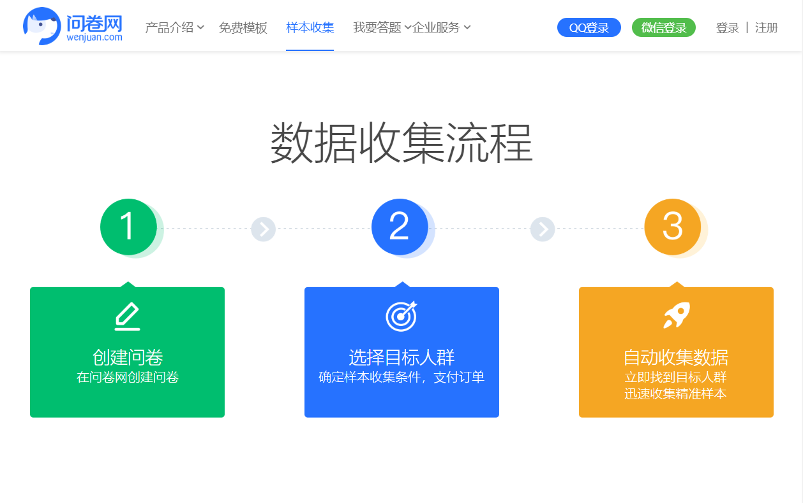
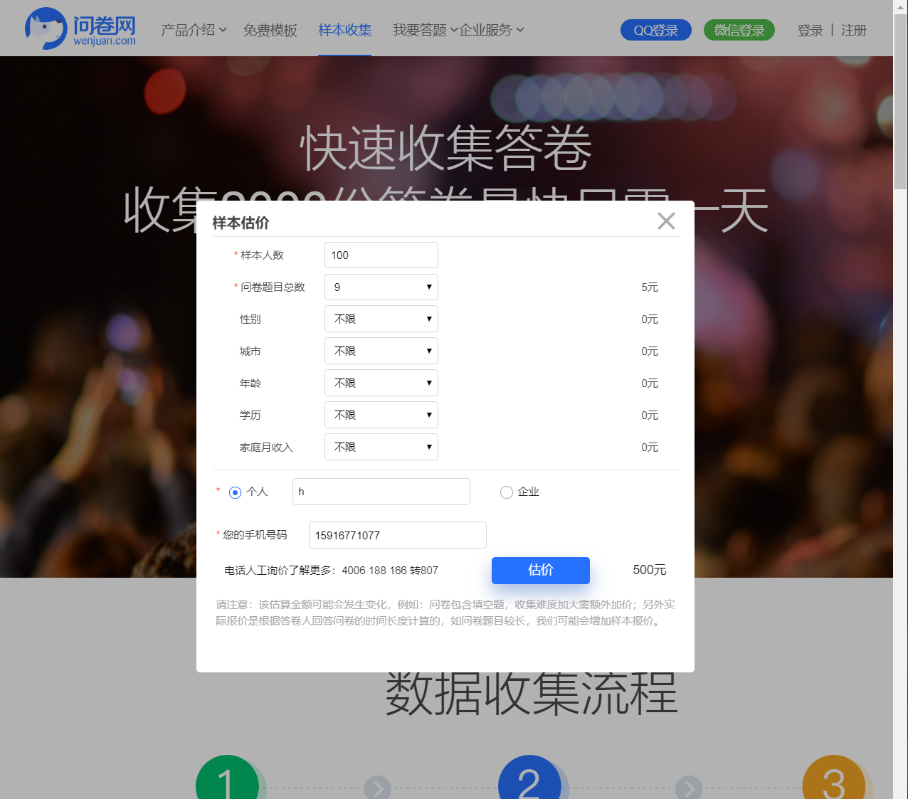
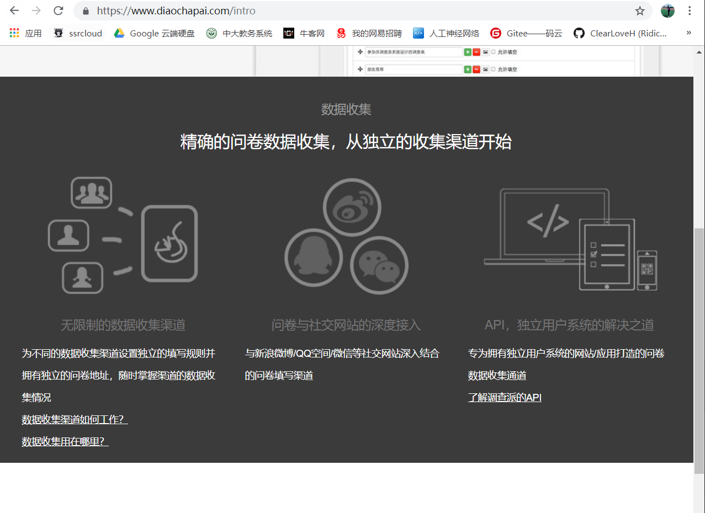
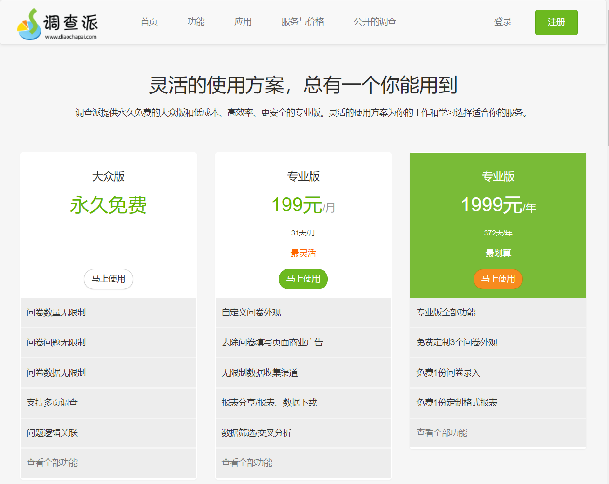
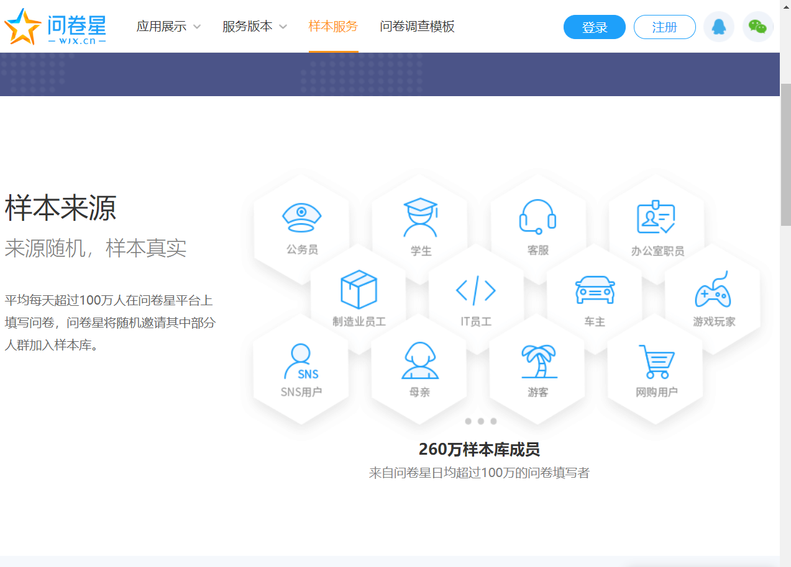
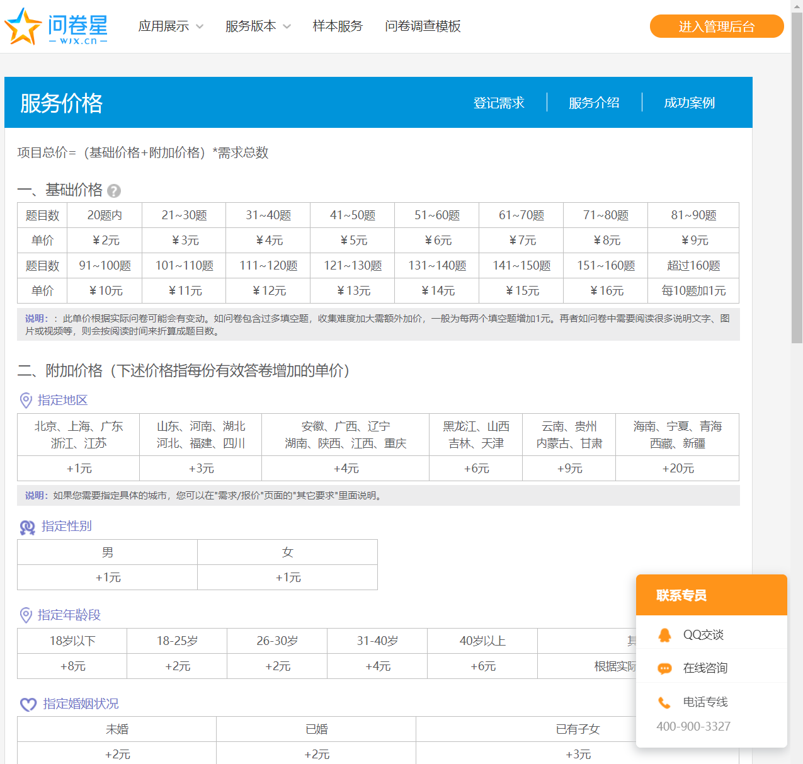

# 闲钱宝项目愿景陈述

## 一、项目概述
闲钱宝是大学生通过做任务挣钱的云平台，也可以理解为面向大学生的专业“众包”系统，我们旨在提供一个既可让大学生将闲余时间转换为小额薪酬、又可以让有需求的用户找到合适的目标群体来完成自己的任务的一个平台，为大学生用户群体以及相关机构提供优质的服务与良好的用户体验。

## 二、项目背景
当今大学生的闲余时间充足，许多大学生对于这部分的时间都不知道该如何正确地规划，再加上短讯息、短视频类的APP风靡全国，许多人都将碎片化时间花在了这些应用之上；另一方面，来到大学很多人都遇到过周围的人请求帮忙填写问卷，有些人还用红包的方式来支付相应的报酬，这种方式得到的问卷数量少，而且没办法定向找到目标群体，这样的调研分析结果是不太具有普遍性的。而市面上又没有这样一款比较好的、知名度高的问卷/任务发布中心，所以闲钱宝在这时候横空出世，就是为了满足这部分用户的需求。

## 三、业务场景
- “奶牛”——发布任务的机构或用户，在我们的闲钱宝平台上发布相关需求与薪酬，而其他学生在平台上看到以后，觉得任务时间恰好满足自己，便接手这个任务，然后去完成并获得相应赏金。

    
    

- 实验室项目又需要问卷调研了，这次我们不再群发红包的方式来收集问卷，而是进入闲钱宝平台来有偿寻找问卷需要投放的目标用户，这下问卷数量和质量都有保证了。而目标群体用户在问卷中心看到这个新的问卷发布以后，正好是自己感兴趣的内容，便帮忙填写了这个问卷，同时还可以获得小额薪酬，妙哉，妙哉。

    
    

- 闲钱宝功能模块设计

    

## 四、项目亮点
1. 闲钱宝的问卷中心可以让用户自由选择发布的某个问卷来填写，这样情况下的收集到的问卷往往是符合问卷发布者的意向人群的，这样可以让收集到的问卷的质量非常之高。
2. 市面上问卷中心功能的平台，大多数没有闲钱宝所具备的任务发布功能，而且大问卷平台的样本服务都需要不少的费用，平台太大对我们学生的使用也是不太方便的。
3. 作为一个Web应用，闲钱宝可以同时在不同的终端进行适配，对于PC和移动设备有着自适应的不同UI。
4. 闲钱宝另一大亮点，移动端上的闲钱宝在chrome等浏览器上可以将Web页面作为一个APP应用安装到手机之中，随时可以打开APP访问。
 

## 五、竞争分析
首先来看看市面上已有的几款大的同类平台

### 问卷网
- 提供服务

    
- 收费

    

### 调查派
- 提供服务

    
- 收费

    

### 问卷星
- 提供服务

    
- 费用

    

看完这些大平台的问卷系统，可以发现，他们提供的创建问卷的功能都是免费的，但是重点是问卷样本的获取，如果是需要自己转发收集样本，那是违背了我们闲钱宝项目设计初衷的，我们闲钱宝的项目愿景就是希望可以做到问卷能让指定用户群体填写。但是用这些大平台的数据，可以看到他们的费用是令人发指的，100份样本就要上千元，对于一些校内收集数据的同学来说是无法承担这样的成本的。

所以闲钱宝的竞争优势在此，就是让**问卷样本的收集变得更加简单且成本低廉**。我们针对用户群体本就不需要几万几十万的样本，对于几百份样本规格的迷你调研，闲钱宝的优势就体现了出来，所以我们也并不需要和这些大平台去竞争，因为我们针对的用户群体都不一样。大平台针对的是企业用户，收费颇高；我们针对学生群体，让迷你规模的调研变得简易可行。